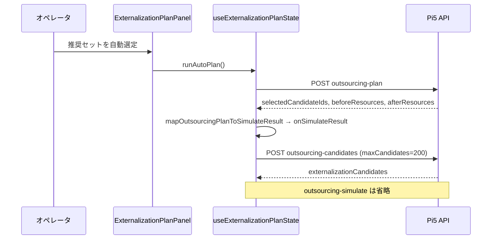

# KB-362: キオスク負荷調整（山崩し支援）画面

## Context

キオスク **負荷調整**（`/kiosk/production-schedule/load-balancing`）は、生産日程の未完了工程を資源CD単位で可視化し、山崩し（負荷移管）候補を提示する機能である。

| マイルストーン | ブランチ | 内容 |
|----------------|----------|------|
| 2026-04-30 初版 | `feat/kiosk-load-balance-suggest` | 資源CD俯瞰・能力設定・サジェスト（`plannedEndDate` 月） |
| 2026-05-26 拡張 | `feat/kiosk-load-balancing-machine-monthly-view` | **機種別月次負荷**タブ（有効納期月・機種/部品/積み上げグラフ） |
| 2026-05-26 拡張 | `feat/kiosk-load-balancing-start-date-leveling` | **着手日・平準化**タブ（日割り・シミュ・稼働日ルール） |
| 2026-05-26 拡張 | `feat/kiosk-load-balancing-outsourcing-sim` | **資源CD俯瞰・外注候補シミュ**（超過資源選択・効果順候補・累積試算） |
| 2026-05-26 拡張 | `feat/kiosk-load-balancing-externalization-plan` | **部品単位推奨セット**（負荷母集団修正・自動 plan・入れ替え）— Pi5 で `outsourcing-plan` / 画面文言を確認 |
| 2026-05-27 修正 | `feat/kiosk-load-balancing-ui-p0p1` · **`cd42ebfe`** | 外注上限 **`outsourcing-simulation.policy.ts` 統一**·自動選定で plan 結果を即反映 — **Pi5 デプロイ済み** |
| 2026-05-27 修正 | `feat/kiosk-load-balancing-aggregation-fix` · **`bef423fe`** | 着手日 **総分のみ**（×指示数廃止）·3タブ母集団 **eligibility** 統一 |
| 2026-05-27 修正 | 同上 · **`37a7b6d4`** | 能力/稼働日/分類/移管の **`site` 優先 + `shared` 補完**（キオスク読み取りのみ） |
| 2026-05-27 修正 | `feat/kiosk-load-balancing-auto-plan-reset-fix` · **`463aeabb`** | **自動選定後の表示維持** — overview セッション境界のみ reset（Web のみ）·**Pi5→Pi4×4 本番・実機 OK** |

**Prisma**: 機種別月次は既存テーブルのみ。着手日・平準化は **`ProductionScheduleResourceWorkCalendar`** 追加（`20260526100000_load_balancing_work_calendar`）。

## 画面構成（3タブ）

| タブ | 月の定義 | 主な用途 |
|------|----------|----------|
| **資源CD俯瞰** | `ProductionScheduleOrderSupplement.plannedEndDate` の暦月 | 単月の資源CD別 必要/能力/超過・**社内移管サジェスト**・**外注候補シミュ** |
| **機種別月次負荷** | **有効納期** = `COALESCE(ProductionScheduleRowNote.dueDate, supplement.plannedEndDate)` の暦月 | 機種（MH/SH の `FHINMEI`）→ 部品 → 月×資源CD の積み上げ |
| **着手日・平準化** | 日割り後を月合算／日別（着手=`plannedStartDate`、終端=有効納期） | `FSIGENSHOYORYO` 総分・稼働日ルール・平準化シミュ（DB不変） |

**重要**: タブごとに「月」「負荷の載せ方」が異なる。混同すると集計が合わない。

**生産システムとの関係**: 生産の積み上げグラフは **`FSIGENSHOYOYMD`（資源所要量）** 軸。キオスクは **着手日・納期** 軸。**数値一致は要件にしない**（2026-05-27 突合）。→ [KB-363](./KB-363-load-balancing-production-system-reconciliation.md) / [ADR-20260527](../decisions/ADR-20260527-load-balancing-aggregation-axis-start-date.md)

## 機種別月次負荷 — 仕様（実装正本）

### 集計対象

- **winner 行**（`buildMaxProductNoWinnerCondition`）
- **負荷 eligibility**（`buildLoadBalancingRowEligibilityWhereSql`）— `fkmail` 同期済み・**C/X 除外**（S/R/O/P）・**実効未完了**
- **品番** `FHINCD` が `MH%` / `SH%` **以外**（部品工程のみ）
- **資源CD** 非空・切断工程除外（資源カテゴリ設定）
- **有効納期** が指定期間内（`fromMonth`〜`toMonth`  inclusive、最大 **12 か月**）

### 機種名

- 製番ごとに MH/SH 行の **`FHINMEI`** を `resolveSeibanMachineDisplayNamesBatched` で解決
- 未登録は **`機種名未登録`**

### API 応答と UI 挙動

- `GET /kiosk/production-schedule/load-balancing/machine-monthly-load`
  - Query: `fromMonth`, `toMonth`, 任意 `targetDeviceScopeKey`, `machineName`, `fhincd`
  - 常に **`machines[]`**（期間内の機種サマリ）を返す
  - `machineName` 指定時のみ **`parts[]`**, **`resourceMonths[]`**, **`partRows[]`**
- **部品絞り込み（`fhincd`）**: グラフ・月×資源明細・工程行のみ絞る。**部品一覧は機種全体を維持**（行クリック後も他品番を選び直せる）

### 実装レイヤ（境界）

| 層 | ファイル |
|----|----------|
| ルート | `apps/api/src/routes/kiosk/production-schedule/load-balancing.ts` |
| SQL 取得 | `machine-monthly-load-query.service.ts` |
| 機種名付与・月キー | `machine-monthly-load.service.ts` |
| DTO 組み立て | `machine-monthly-load-assembler.ts` |
| 月範囲 | `year-month-range.ts` |
| Web タブ | `LoadBalancingMachineMonthlyTab.tsx` |
| ページシェル | `ProductionScheduleLoadBalancingPage.tsx`（タブ + Mac 代理） |

## 着手日・平準化 — 仕様（実装正本）

### 集計対象

 - **負荷 eligibility**（機種別月次と同じ `buildLoadBalancingRowEligibilityWhereSql`）を満たす行を取得する。
 - **`plannedStartDate` と有効納期が両方ある行**は配分対象。いずれか欠損する行は **未配分**（`missing_planned_start_date` / `missing_effective_due_date`）として返す。
- **負荷（分）** = **`FSIGENSHOYORYO` 行総分**（0 分は **未配分** `zero_required_minutes`）。
- **日割り**: 着手日〜有効納期（ inclusive ）の **稼働日**に均等配分。稼働日は資源CDごとに `weekdays` または `calendar_days`（未設定は **weekdays**）。
- **月次能力**: 既存の基準/月次上書き。日次表示では **月能力 ÷ 当該月の稼働日数** を日次能力線とする。

### API

- `GET .../start-date-leveling` — `bucket=month|day`、`focusMonth`（日次時）、任意 `resourceCd`
- `POST .../start-date-leveling/simulate` — `moves: [{ rowId, targetDate }]`。**DB 更新なし**（行の全負荷を移動先日に寄せて再集計）

### 管理設定

- `GET/PUT /production-schedule-settings/load-balancing/work-calendars`

## 資源CD俯瞰・外注候補シミュ — 仕様（実装正本）

### 用語

- **社内移管サジェスト**（既存 `POST .../suggestions`）: 分類/移管ルールに基づき **別の社内資源CD** へ移す候補。移管先にも負荷が載る。
- **外注候補シミュ**（Phase 0）: 選択した **工程行** を社内資源の必要分から除外する read-only 試算。
- **推奨セット**（部品単位）: `fseiban` + `productNo` + `fhincd` で束ねた **部品候補** の自動選定・手動入れ替え。試算は `selectedCandidateIds` で行う。**DB 更新なし**。外注先能力は見ない。

### 負荷母集団（資源CD俯瞰・外注・社内移管サジェストのみ）

`load-balancing-eligibility.policy.ts` が **3タブ共通**の負荷母集団正本（`monthly-load-query` / `machine-monthly-load-query` / `start-date-leveling-query`）。

| 項目 | 内容 |
|------|------|
| 月キー | `plannedEndDate` の暦月 |
| 工数 | **`FSIGENSHOYORYO` 合計**（行総分。`× plannedQuantity` しない） |
| FKOJUNST | **`fkmail` あり** かつ **S/R/O/P**（**C/X 除外**） |
| 完了 | **実効未完了**（手動完了・外部完了は負荷から除外） |

### 効果指標

- 工程行: `overReductionMinutes = min(行分, 源資源の超過分)` 降順。
- 部品候補: 同一部品の複数工程を束ね、資源ごとに `min(部品合計, 源超過)` で **二重カウントしない** `totalOverReductionMinutes`。

### API

| エンドポイント | 用途 |
|----------------|------|
| `POST .../outsourcing-candidates` | 既存 `candidates`（工程行）+ **`externalizationCandidates`**（部品） |
| `POST .../outsourcing-plan` | 戦略 `max_over_reduction` で部品推奨セット自動選定 |
| `POST .../outsourcing-simulate` | **`selectedRowIds`** または **`selectedCandidateIds`** のどちらか一方（同時指定・両方空は 400） |
| `POST .../outsourcing-replacements` | 1 部品を外したときの代替候補（最大 5 件） |

**上限（単一正本: `outsourcing-simulation.policy.ts`）**

| 項目 | 上限 |
|------|------|
| 部品候補プール（plan / simulate 内部） | **500** |
| `outsourcing-candidates` の `maxCandidates` | **200**（既定 **100**） |
| `selectedCandidateIds`（simulate / replacements） | **500** |
| `overResourceCds` | **100** |

- 自動選定 UI は **plan 応答の `beforeResources` / `afterResources`** を `mapOutsourcingPlanToSimulateResult` 経由でチャートに反映し、続けて **candidates**（`maxCandidates: 200`）で部品表メタを取得する。**plan 成功後の `outsourcing-simulate` は呼ばない**（手動工程行シミュ・入れ替え後の再試算は従来どおり simulate 可）。
- `candidateId` = 正規化した `fseiban` + `\u001f` + `productNo` + `\u001f` + `fhincd`（UI には生 ID を出さない）。
- `FHINMEI` は行の品名（`LoadBalancingRowCandidate.fhinmei`）。機種名解決は部品名用途に使わない。

### 自動選定フロー（Web · `cd42ebfe` 以降）



| 段階 | 失敗時の UI |
|------|-------------|
| plan **400/500** | `actionError`（`formatExternalizationPlanActionError`） |
| candidates **400** | 同上（チャートは plan 反映済みのまま残る場合あり） |
| 超過資源 0 / scope 未選択 | ボタン disabled または `actionError` |

**修正前（`c27aa3ec` 以前）の典型**: plan **200** → candidates **`maxCandidates:500` で 400** → simulate **`selectedCandidateIds`>100 で 400** · いずれも **`planError` のみ**で Panel に出ず **無反応**に見えた。

### UI（資源CD俯瞰タブ）

1. 超過資源を複数選択（初期は全超過資源）
2. **推奨セット（部品）**: 「推奨セットを自動選定」→ 部品表・残超過・外す / 入れ替え / クリア
3. **工程行（従来・折りたたみ）**: 外注候補取得 → チェック → 累積シミュ
4. 試算後の必要分/超過はチャート・明細で共有（シミュ結果クリアで元に戻す）

### 実装レイヤ

| 層 | ファイル |
|----|----------|
| 負荷母集団 | `load-balancing-eligibility.policy.ts`, `monthly-load-query.service.ts` |
| 上限定数 | `outsourcing-simulation.policy.ts` |
| 純関数 | `outsourcing-simulation.engine.ts` |
| サービス | `outsourcing-simulation.service.ts` |
| Web | `LoadBalancingOverviewTab.tsx`, `loadBalancingOverviewSession.ts`, `useExternalizationPlanState.ts`, `ExternalizationPlanPanel.tsx`, `loadBalancingOutsourcingLimits.ts`, `loadBalancingOutsourcingSelection.ts`, `mapOutsourcingPlanToSimulateResult.ts`, `externalizationPlanErrors.ts`, `loadBalancingExternalization.ts` |
| 上限 ADR | [ADR-20260527 外注上限](../decisions/ADR-20260527-load-balancing-outsourcing-limits.md) |

### デプロイ状況（2026-05-27 時点）

| 機能 | Pi5 | Pi4×4 |
|------|-----|-------|
| 機種別月次・着手日タブ（API+Web） | **デプロイ済**（`60b94b9d` 系） | **デプロイ済**（2026-05-26 Detach 各台） |
| 外注契約整合 + 自動選定フロー | **デプロイ済**（**`cd42ebfe`** · **`20260527-191646-1476`**） | **クライアント同期済**（Pi5 SPA 参照·2026-05-27 Pi4 play） |
| 集計修正 + `shared` 能力フォールバック | **デプロイ済**（**`37a7b6d4`** 系 · **`20260527-161741-7843`**） | **クライアント同期済**（API は Pi5 正本） |
| **自動選定後の表示維持（reset 境界）** | **デプロイ済**（**`463aeabb`** · **`20260527-212706-19231`**） | **デプロイ済**（**`20260527-214538`〜`215913`** 各台） |

**Pi4 キオスクの Web**: 多くは Pi5 **`kiosk_full_url`** 経由で SPA を読む。**Web 修正は Pi5 デプロイが正本**·Pi4 play は **kiosk-browser 再起動・Ansible 同期**。

背景・改善案: [load-balancing-outsourcing-improvement-proposal.md](../plans/load-balancing-outsourcing-improvement-proposal.md)。

### セッション境界と reset（`463aeabb` · Web のみ）

**症状**: `cd42ebfe` 以降、**推奨セットを自動選定**は API **200** だが、直後に部品表・チャート・`（外注シミュ結果）` 表示が消え **無反応に見える**。

**原因**: `LoadBalancingOverviewTab` の `useEffect` が **`overResourceOptions` の配列参照**を依存に含み、React Query の overview **同値再フェッチ**（`staleTime` 60s 内の再評価）だけで `setSimulateResult(null)` + `resetPlanState()` を実行していた。

**契約（正本）**: `loadBalancingOverviewSession.ts`

| 識別子 | 意味 | 変化時の挙動 |
|--------|------|----------------|
| `month` | 俯瞰タブの対象月 | 外注試算 state を **破棄** |
| `scopeKey` | `targetDeviceScopeKey`（Mac 代理含む） | 同上 |
| `overResourceKey` | 選択中の超過資源 CD を **ソート連結**したキー | 同上・**超過資源の再選択同期**もこの変化時のみ |
| （境界外） | `overResourceOptions` 配列の参照・中身が同集合 | **reset しない**（plan / simulate 表示を維持） |

**実装分割**:

- **セッション reset**（`shouldResetLoadBalancingOverviewSession`）: 上記 3 キーのいずれかが変わったときのみ `simulateResult` クリア + `resetPlanState()`。
- **超過資源 state 同期**: `overResourceKey` 変化時のみ `setSelectedOverResourceCds`（overview 再評価だけでは走らない）。

**テスト**: `loadBalancingOverviewSession.test.ts` · `ProductionScheduleLoadBalancingPage.test.tsx`（同値 overview 再評価でも plan 表示維持）。

**API・DB**: 変更なし（デプロイは **Web バンドル**が主。Pi4 play はクライアント側同期）。

## Production deploy（実績 2026-05-26 · 外注候補シミュ · Pi5 のみ）

- **ブランチ**: `feat/kiosk-load-balancing-outsourcing-sim`
- **コミット**: **`128f89bd`**
- **CI**: **`26443561903`** success
- **ホスト**: `raspberrypi5` のみ（Pi4×4 は未展開）

| 項目 | 値 |
|------|-----|
| Detach Run ID | `20260526-183237-15690` |
| PLAY RECAP | `ok=134` `changed=4` `failed=0` |
| Phase12 | **43 / 0 / 0** |

**手動スモーク（Pi5）**: `outsourcing-candidates` / `outsourcing-simulate` **200** · Web バンドルに `外注候補` 文字列確認。

## Symptoms / 使い方

1. キオスク **負荷調整** を開く
2. **機種別月次負荷** タブ → 開始月・終了月（初期 **当月〜+6か月**）
3. 機種（`FHINMEI`）を選択 → 積み上げ棒（上位24資源）・部品表
4. 部品行クリック → 当該品番に絞り込み（「部品絞り込み解除」で解除）
5. **資源CD俯瞰** タブ → 超過資源選択 → **推奨セット自動選定**（部品）または工程行で累積シミュ（DB不変）
6. **社内移管サジェスト** は同タブ下部（分類/移管ルール前提）

Mac device-scope v2: **`targetDeviceScopeKey` 必須**（未指定 400）。

## Production deploy（実績 2026-05-26 · 機種別月次）

- **ブランチ**: `feat/kiosk-load-balancing-machine-monthly-view`
- **代表コミット**: **`60b94b9d`** `feat(kiosk): add machine monthly load view`
- **CI（機能）**: GitHub Actions **`26434510513`**（push 時）
- **ホスト順（`--limit` 1台ずつ）**: Pi5 → Pi4×4。**Pi3 対象外**

| ホスト | Detach Run ID | PLAY RECAP |
|--------|---------------|------------|
| `raspberrypi5` | `20260526-151127-15681` | `ok=134` `changed=4` `failed=0` |
| `raspberrypi4` | `20260526-155923-28871` | `ok=122` `changed=11` `failed=0` |
| `raspi4-robodrill01` | `20260526-160414-3113` | `ok=122` `changed=10` `failed=0` |
| `raspi4-fjv60-80` | `20260526-160801-21722` | `ok=122` `changed=10` `failed=0` |
| `raspi4-kensaku-stonebase01` | `20260526-161142-6365` | `ok=129` `changed=11` `failed=0` |

**標準コマンド**:

```bash
export RASPI_SERVER_HOST="denkon5sd02@100.106.158.2"
./scripts/update-all-clients.sh feat/kiosk-load-balancing-machine-monthly-view infrastructure/ansible/inventory.yml --limit <host> --detach --follow
```

## 実機検証（2026-05-26）

### 自動

- `./scripts/deploy/verify-phase12-real.sh` → **PASS 43 / WARN 0 / FAIL 0**（Pi5+Pi4 デプロイ後・約 **28s**）
- **注意**: 本スクリプトは **`machine-monthly-load` を直接叩かない**（負荷調整専用 curl は手動スモーク推奨）

### 手動スモーク（Pi5 · Tailscale `100.106.158.2`）

```bash
KEY="client-key-raspberrypi4-kiosk1"
BASE="https://100.106.158.2"

# 俯瞰（回帰）
curl -sk "${BASE}/api/kiosk/production-schedule/load-balancing/overview?month=2026-05" \
  -H "x-client-key: ${KEY}"

# 機種別月次
curl -sk "${BASE}/api/kiosk/production-schedule/load-balancing/machine-monthly-load?fromMonth=2026-05&toMonth=2026-10" \
  -H "x-client-key: ${KEY}"
```

**実績（2026-05-26）**: `overview` **200** / `machine-monthly-load` **200**（`machines` 約74件・`months` 6）/ `suggestions` POST **200**。

**Web**: `docker-web-1` バンドル `/srv/site/assets/index-*.js` に **`機種別月次負荷`** 文字列を確認。Pi5 HEAD **`60b94b9d`**。

### 現場目視（推奨チェックリスト）

- [ ] Pi4 キオスクで **機種別月次負荷** タブ表示
- [ ] 機種選択後グラフ・部品表・明細表
- [ ] 部品行クリック → 絞り込み → 解除
- [ ] **資源CD俯瞰** タブ・サジェストが従来どおり動作

## 能力設定と `shared` / `siteKey`（2026-05-27）

### 背景（非対称の典型）

| 保存・参照 | 識別子 | 備考 |
|------------|--------|------|
| 管理画面（負荷調整設定） | 既定 **`shared`** | `ProductionScheduleSettingsPage` のロケーション選択 |
| キオスク API | **`siteKey`（例: `第2工場`）** | 端末の工場スコープから解決 |
| 資源カテゴリ（切断除外） | **既に** `site` 優先 + `shared` フォールバック | [KB-297](./KB-297-kiosk-due-management-workflow.md) と同型 |

**2026-05-27 以前**: 能力・月次能力・稼働日・分類・移管は **site 直読のみ** のため、管理で `shared` にだけ保存するとキオスクで **工程能力がすべて `—`**・負荷グラフの能力線が出ないように見えた（`requiredMinutes` は API 上存在）。

### 読み取り契約（`37a7b6d4` 以降）

- キオスク向け: `listLoadBalancingCapacityBasesResolved` 等 **`listLoadBalancing*Resolved` ×5**（`load-balancing-settings-merge.ts`）。
- **マージ規則**: 同一エンティティ種別で **`siteKey` 行を優先**。site に無いキーのみ **`shared` から補完**。
- **管理向け**: raw `list*` / `replace*` は **変更なし**（保存先は従来どおり `shared` 可）。
- **ログ**: 補完発生は **`debug`**。site も shared も空のときのみ **`warn`**。

| Resolved API | 補完キー（代表） |
|------------|------------------|
| 基準能力 | `resourceCd` |
| 月次能力上書き | `resourceCd` + `yearMonth` |
| 資源分類 | `resourceCd` |
| 移管ルール | `(fromClassCode, toClassCode, priority)` |
| 稼働日カレンダー | `resourceCd` |

**移管ルールの注意**: site で from/to 相同・priority のみ変更した場合、shared の **別 priority** 行は **両方有効**のまま（DB unique と一致）。

### 実装レイヤ（境界）

| 層 | ファイル |
|----|----------|
| マージ純関数 | `load-balancing-settings-merge.ts` |
| Resolved 読み取り | `load-balancing-settings.service.ts` |
| 呼び出し | `load-balancing-overview.service.ts` · `start-date-leveling-assembler.ts` · `reallocation-suggestion.service.ts` |

### 調査メモ（Pi5 本番 DB · 2026-05-27）

- `ProductionScheduleResourceCapacityBase`: **9 件すべて `siteKey='shared'`**、site 直指定 **0 件**（当時）。
- `overview` は `requiredMinutes` **27 資源**返却・能力は **全 `null`**（旧 API）。
- デプロイ後（`20260527-161741-7843`）: 同月 `overview` で **9/27 資源**に `availableMinutes`（例: `021`→75600、`033`→37800）。未登録資源は **`null` のまま**（仕様）。

## 実機検証（2026-05-27 · 集計修正 + shared フォールバック）

**前提**: Pi5 のみデプロイ（`37a7b6d4`）。Pi4×4 は **未**（Web 文言差分は次段）。

### 自動

- `./scripts/deploy/verify-phase12-real.sh` → **PASS 43 / WARN 0 / FAIL 0**（約 **30s**）

### 手動スモーク（Pi5 · Tailscale `100.106.158.2`）

```bash
KEY="client-key-raspberrypi4-kiosk1"
BASE="https://100.106.158.2"

curl -sk "${BASE}/api/kiosk/production-schedule/load-balancing/overview?month=2026-05" \
  -H "x-client-key: ${KEY}"

curl -sk "${BASE}/api/kiosk/production-schedule/load-balancing/machine-monthly-load?fromMonth=2026-05&toMonth=2026-10" \
  -H "x-client-key: ${KEY}"

curl -sk "${BASE}/api/kiosk/production-schedule/load-balancing/start-date-leveling?fromMonth=2026-05&toMonth=2026-05&bucket=month" \
  -H "x-client-key: ${KEY}"
```

**実績（2026-05-27）**: いずれも **HTTP 200**。`overview` / `start-date-leveling` で **9/27** 資源に `availableMinutes`。`machine-monthly-load` で **machines 約74**・`months` 6。

### 現場目視（推奨）

- [ ] **資源CD俯瞰**: 登録済み資源で工程能力が **`—` 以外**
- [ ] **機種別月次**: 機種選択後グラフ表示（未選択時は空＝仕様）
- [ ] **着手日・平準化**: 月次/日次切替・能力線（登録資源のみ）

## Production deploy（実績 2026-05-27 · 集計修正 + shared · Pi5 のみ）

- **ブランチ**: `feat/kiosk-load-balancing-aggregation-fix`
- **コミット**: **`bef423fe`** · **`37a7b6d4`**
- **PR**: [#350](https://github.com/denkoushi/RaspberryPiSystem_002/pull/350)
- **CI**: **`26496156604`** success

| 項目 | 値 |
|------|-----|
| Detach Run ID（Pi5） | `20260527-161741-7843` |
| PLAY RECAP | `ok=134` `changed=4` `failed=0` |
| Phase12 | **43 / 0 / 0** |
| Pi4×4 | **未デプロイ** |

**標準コマンド**（Pi4 展開時は `<host>` を 1 台ずつ）:

```bash
export RASPI_SERVER_HOST="denkon5sd02@100.106.158.2"
./scripts/update-all-clients.sh feat/kiosk-load-balancing-aggregation-fix infrastructure/ansible/inventory.yml --limit <host> --detach --follow
```

**参照**: [deployment.md §2026-05-27](../guides/deployment.md#kiosk-load-balancing-aggregation-fix-2026-05-27)

## 実機検証（2026-05-27 · 外注契約整合 + 自動選定フロー）

**前提**: Pi5 のみデプロイ（**`cd42ebfe`**）。Pi4×4 は **未**。

### 自動

- `./scripts/deploy/verify-phase12-real.sh` → **PASS 43 / WARN 0 / FAIL 0**（約 **115s**）
- Pi5 Git: **`cd42ebfe`** · `feat/kiosk-load-balancing-ui-p0p1`

### 手動スモーク（Pi5 · Tailscale `100.106.158.2`）

```bash
KEY="client-key-raspberrypi4-kiosk1"
BASE="https://100.106.158.2"
MONTH="2026-05"

# 超過資源 CD を overview から取得して OVER_JSON に渡す
curl -sk "${BASE}/api/kiosk/production-schedule/load-balancing/overview?month=${MONTH}" \
  -H "x-client-key: ${KEY}"

curl -sk -X POST "${BASE}/api/kiosk/production-schedule/load-balancing/outsourcing-plan" \
  -H "x-client-key: ${KEY}" -H "Content-Type: application/json" \
  -d "{\"month\":\"${MONTH}\",\"overResourceCds\":[\"021\",\"033\"],\"strategy\":\"max_over_reduction\"}"

# 上限確認: 200 は OK、500 は 400（VALIDATION_ERROR maximum 200）
curl -sk -w "\nHTTP %{http_code}\n" -X POST \
  "${BASE}/api/kiosk/production-schedule/load-balancing/outsourcing-candidates" \
  -H "x-client-key: ${KEY}" -H "Content-Type: application/json" \
  -d "{\"month\":\"${MONTH}\",\"maxCandidates\":500}"
```

**実績（2026-05-27）**: `overview` / `machine-monthly-load` / `start-date-leveling` / `outsourcing-plan` / `outsourcing-simulate` **HTTP 200** · `outsourcing-candidates` **`maxCandidates=200` → 200** · **`maxCandidates=500` → 400**（`maximum: 200`）· Web バンドル **`推奨セットを自動選定`**（`index-2R2Tbs6B.js`）· `outsourcing-plan` **約 1.1s**（超過資源 18 件・`selectedCandidateIds` **220** 件 · `beforeResources`/`afterResources` あり）

**Detach Run ID**: `20260527-191646-1476` · CI **`26504703984`** success · PR [#351](https://github.com/denkoushi/RaspberryPiSystem_002/pull/351) · **`main`** squash **`c5f02576`**

### 現場目視（契約整合 · 2026-05-27）

- [x] **資源CD俯瞰** → **推奨セットを自動選定**（応答・一覧·残超過表示）— **reset 修正後（`463aeabb`）に実機 OK**
- [x] 失敗時 **actionError** 表示（超過資源 0·scope 未選択等）— 仕様どおり

**参照**: [deployment.md §契約整合 2026-05-27](../guides/deployment.md#kiosk-load-balancing-ui-p0p1-contract-fix-2026-05-27)

## Production deploy（実績 2026-05-27 · 自動選定表示維持 · Pi5→Pi4×4）

- **ブランチ**: `feat/kiosk-load-balancing-auto-plan-reset-fix`
- **代表コミット**: **`463aeabb`** `fix(kiosk): preserve auto-plan results across overview refresh`
- **変更範囲**: **Web のみ**（`loadBalancingOverviewSession.ts` · `LoadBalancingOverviewTab.tsx` · Vitest）
- **Prisma マイグレーション**: **なし**
- **CI（機能 push）**: GitHub Actions **`26510107150`**（ブランチ push）

| ホスト | Detach Run ID | PLAY RECAP | 備考 |
|--------|---------------|------------|------|
| `raspberrypi5` | `20260527-212706-19231` | `ok=134` `changed=4` `failed=0` | Docker web 再ビルド·**`--follow` 約 494s** |
| `raspberrypi4` | `20260527-214538-9407` | `ok=122` `changed=10` `failed=0` | kiosk-browser 再起動 |
| `raspi4-robodrill01` | `20260527-215102-12190` | `ok=122` `changed=9` `failed=0` | |
| `raspi4-fjv60-80` | `20260527-215507-22961` | `ok=122` `changed=9` `failed=0` | |
| `raspi4-kensaku-stonebase01` | `20260527-215913-24632` | `ok=129` `changed=10` `failed=0` | `barcode-agent` 起動待ち **リトライあり**（最終 `failed=0`） |

**標準コマンド**:

```bash
export RASPI_SERVER_HOST="denkon5sd02@100.106.158.2"
./scripts/update-all-clients.sh feat/kiosk-load-balancing-auto-plan-reset-fix infrastructure/ansible/inventory.yml --limit <host> --detach --follow
```

## 実機検証（2026-05-27 · 自動選定表示維持）

### 自動

- `./scripts/deploy/verify-phase12-real.sh` → **PASS 43 / WARN 0 / FAIL 0**（Pi5 後約 **57s**·Pi4 群後約 **53s**）
- Pi5 Git: **`463aeabb`**

### API スモーク（Pi5 · Tailscale `100.106.158.2`）

```bash
KEY="client-key-raspberrypi4-kiosk1"
BASE="https://100.106.158.2"
MONTH="2026-05"
# overview から overMinutes>0 の資源 CD を overResourceCds に渡す
curl -sk -X POST "${BASE}/api/kiosk/production-schedule/load-balancing/outsourcing-plan" \
  -H "x-client-key: ${KEY}" -H "Content-Type: application/json" \
  -d "{\"month\":\"${MONTH}\",\"overResourceCds\":[\"035\",\"051\",\"052\"],\"strategy\":\"max_over_reduction\"}"
```

**実績（2026-05-27 · デプロイ後）**:

| エンドポイント | HTTP | 所要時間（目安） | 備考 |
|--------------|------|------------------|------|
| `overview` | 200 | ~1.9s | |
| `outsourcing-plan`（超過 18 資源） | 200 | ~0.8s | `selectedCandidateIds` **220**·超過 **18→0** |
| `machine-monthly-load` | 200 | ~23.4s | 初回重い（別系統） |
| `start-date-leveling` | 200 | ~18.5s | 同上 |
| `outsourcing-candidates` `maxCandidates=500` | **400** | — | `maximum: 200`（契約どおり） |

**Web（Pi5 `docker-web-1`）**: `/srv/site/assets/index-BhBgMfpi.js` に **`推奨セットを自動選定`**・**`simulateResult`** を確認（minify のため関数名は残らない）。

### 現場目視（2026-05-27 · ユーザー確認済）

- [x] **推奨セットを自動選定** 押下後、部品一覧・残超過・`（外注シミュ結果）` が **消えない**
- [x] 月・device scope・超過資源集合を変えたときのみ試算 state がリセットされる

**参照**: [deployment.md §表示維持 2026-05-27](../guides/deployment.md#kiosk-load-balancing-auto-plan-reset-fix-2026-05-27)

## Troubleshooting

| 症状 | 確認・対処 |
|------|------------|
| `overview` / `machine-monthly-load` が **401/403** | `x-client-key` と端末登録 |
| **能力分がすべて `—`** | (1) 管理の保存先が **`shared` のみ** かつ **`*Resolved` 未デプロイ**（本件）。(2) 当該資源に能力未登録（`availableMinutes: null` は正常）。(3) キオスク画面の **`siteKey:`** 表示と管理ロケーションの意図が一致するか |
| **負荷は出るが能力だけ `—`** | `overview` の `requiredMinutes` はあるが `availableMinutes` が全 `null` → 上記 (1) を疑う。curl で JSON 確認 |
| **デプロイが即拒否** | ローカル **未コミット変更** — `update-all-clients.sh` はリモートブランチのみ |
| Mac 代理で **400** | `targetDeviceScopeKey` 未指定（device-scope v2） |
| **月範囲エラー 400** | `fromMonth` > `toMonth`、または **12か月超** |
| **機種一覧は出るがグラフが空** | 機種未選択（仕様）。または期間内に有効納期付き未完了行なし |
| **部品絞り込み後、部品表が1行だけ** | **2026-05-26 以前の不具合**。修正後は部品表は機種全体のまま |
| **Pi4 だけ旧UI** | Pi4 未デプロイ or キャッシュ → 該当ホストに `--limit` 再デプロイ、[強制リロード](../guides/verification-checklist.md) §6.6.4 |
| **API 500 が 400 表示** | ルートは入力検証系のみ 400 化。DB/内部エラーは 500 のまま（ログ確認） |
| **推奨セット自動選定が無反応** | (1) Mac で **device scope 未選択** → ボタン disabled。(2) 超過資源 **0 件**。(3) **修正前**（`c27aa3ec` 以前）: `maxCandidates:500` / plan>100 件で後続 API **400** かつ **`planError` のみ** — **`cd42ebfe`** で解消。(4) **修正前**（`cd42ebfe` 〜 **`463aeabb` 未満**）: plan **200** 直後に表示が消える → overview 同値再評価で reset — **`463aeabb`** で解消（[§セッション境界](#セッション境界と-reset463aeabb--web-のみ)）。(5) **Pi5 未反映** → `git rev-parse --short HEAD` が **`463aeabb` 以降**か·Web バンドルに **`推奨セットを自動選定`** があるか |
| **選定直後に一瞬出て消える** | DevTools Network で plan **200** かつ直後に UI だけ空 → **(4)** を疑う。修正後も再発する場合は **強制リロード**（[verification-checklist §6.6.4](../guides/verification-checklist.md)） |
| **自動選定は遅いが他タブも重い** | **別系統**: 初回 `machine-monthly-load` **~20s**・`start-date-leveling` **~29s**（2026-05-27 実測）。自動選定は **plan ~1s + candidates**（simulate 省略後）。React Query **`staleTime`** overview **60s** / 重タブ **120s** |
| **plan は成功するが部品表が空** | `candidates` が 200 cap でメタ未取得 · Network で **400** を確認 · `actionError` 文言 |
| **チャートだけ更新され部品行がない** | 選定 ID はあるが `externalizationCandidates` に未載の ID（200 件プール外）— 部品行は **selectedCandidateIds** ベースで表示する設計を確認 |
| **ローカル API 全件テスト失敗** | Postgres 未起動 / **`pnpm exec prisma migrate deploy` は `apps/api` で実行**（`scripts/test/run-tests.sh` 参照） |

## Prevention

- 月定義を変える場合は **両タブのドキュメント**（本 KB・[ガイド](../guides/kiosk-production-schedule-load-balancing.md)）を同時更新
- サジェスト条件変更は管理画面の負荷調整設定 + 俯瞰タブで再確認
- **外注上限を変える場合**は `outsourcing-simulation.policy.ts` のみ編集し、ルート Zod・Web `loadBalancingOutsourcingLimits.ts`・Vitest を同時更新（[ADR](../decisions/ADR-20260527-load-balancing-outsourcing-limits.md)）
- デプロイは [deployment.md](../guides/deployment.md) の **`update-all-clients.sh` + `--limit` 1台ずつ** のみ（Pi3 は本機能では除外）

## Investigation（2026-05-27 · 無反応・遅延の切り分け）

| 仮説 | 検証 | 結果 |
|------|------|------|
| ボタンが disabled | device scope / 超過資源 0 | **CONFIRMED** あり得る（仕様） |
| plan 後 API 400 | Pi5 curl · DevTools Network | **CONFIRMED** `maxCandidates:500`・`selectedCandidateIds`>100 |
| simulate 必須で遅い | コードレビュー | **REJECTED** plan と同等の before/after を返す |
| 全タブ初回が重い | curl 計測 | **CONFIRMED** 別 API（月次・平準化） |

**根本原因（無反応・契約）**: **契約不整合** + **エラー表示が plan のみ** + **simulate 直列**。修正は **`cd42ebfe`**（policy 単一化・mapper・`actionError`・simulate 省略）。

## Investigation（2026-05-27 · 自動選定後に表示が消える）

| 仮説 | 検証 | 結果 |
|------|------|------|
| plan / candidates API 失敗 | Pi5 curl · Vitest | **REJECTED**（200・契約整合後） |
| `mapOutsourcingPlanToSimulateResult` 不正 | 単体テスト・ランタイムログ | **REJECTED** |
| reset `useEffect` が同値 overview 再評価で発火 | Vitest 回帰・NDJSON ログ | **CONFIRMED** |
| simulate 省略で最終書き込みが無い | git diff `db04a1b71`→`cd42ebfe` | **CONFIRMED**（復旧手段が消えた） |

**根本原因（表示消失）**: `LoadBalancingOverviewTab` の `useEffect` が **`overResourceOptions` 配列参照**を依存に含み、**月/scope/超過資源集合が同じでも** `setSimulateResult(null)` + `resetPlanState()` を実行していた。

**対策**: `loadBalancingOverviewSession.ts` で **セッション境界**（`month` / `scopeKey` / `overResourceKey`）のみ reset。超過資源の再選択同期は **`overResourceKey` 変化時のみ**。Web: `loadBalancingOverviewSession.ts` · `LoadBalancingOverviewTab.tsx` · 回帰 `ProductionScheduleLoadBalancingPage.test.tsx`。

**本番**: **`463aeabb`** · Pi5→Pi4×4 デプロイ済 · **現場目視 OK**（[§実機検証 表示維持](#実機検証2026-05-27--自動選定表示維持)）。

## References

- [ADR-20260527: 外注上限の単一正本](../decisions/ADR-20260527-load-balancing-outsourcing-limits.md)
- [KB-363: 生産システム突合（2026-05-27）](./KB-363-load-balancing-production-system-reconciliation.md)
- [運用ガイド: kiosk-production-schedule-load-balancing.md](../guides/kiosk-production-schedule-load-balancing.md)
- [deployment.md §集計修正 2026-05-27](../guides/deployment.md#kiosk-load-balancing-aggregation-fix-2026-05-27)
- [deployment.md §表示維持 2026-05-27](../guides/deployment.md#kiosk-load-balancing-auto-plan-reset-fix-2026-05-27)
- [deployment.md §機種別月次 2026-05-26](../guides/deployment.md#kiosk-load-balancing-machine-monthly-view-2026-05-26)
- [PR #350](https://github.com/denkoushi/RaspberryPiSystem_002/pull/350)
- 初版デプロイ（2026-04-30）: 本ファイル §Production deploy 履歴は [deployment.md §2026-04-30 負荷調整](../guides/deployment.md) 参照
