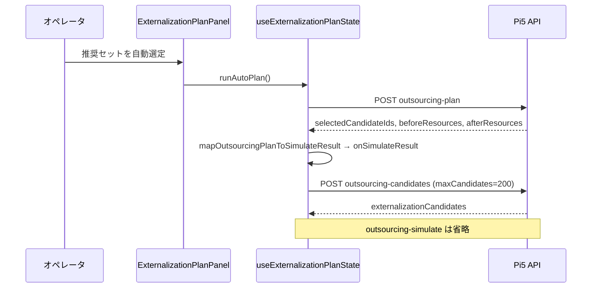

# KB-362: キオスク負荷調整（山崩し支援）画面

## Context

キオスク **負荷調整**（`/kiosk/production-schedule/load-balancing`）は、生産日程の未完了工程を資源CD単位で可視化し、山崩し（負荷移管）候補を提示する機能である。

| マイルストーン | ブランチ | 内容 |
|----------------|----------|------|
| 2026-04-30 初版 | `feat/kiosk-load-balance-suggest` | 資源CD俯瞰・能力設定・サジェスト（`plannedEndDate` 月） |
| 2026-05-26 拡張 | `feat/kiosk-load-balancing-machine-monthly-view` | **機種別月次負荷**タブ（有効納期月・機種/部品/積み上げグラフ） |
| 2026-05-26 拡張 | `feat/kiosk-load-balancing-start-date-leveling` | **着手日・平準化**タブ（日割り・シミュ・稼働日ルール） |
| 2026-05-26 拡張 | `feat/kiosk-load-balancing-outsourcing-sim` | **資源CD俯瞰・外注候補シミュ**（超過資源選択・効果順候補・累積試算） |
| 2026-05-26 拡張 | `feat/kiosk-load-balancing-externalization-plan` | **部品単位推奨セット**（負荷母集団修正・自動 plan・入れ替え）— Pi5 で `outsourcing-plan` / 画面文言を確認 |
| 2026-05-27 修正 | `feat/kiosk-load-balancing-ui-p0p1` · **`cd42ebfe`** | 外注上限 **`outsourcing-simulation.policy.ts` 統一**·自動選定で plan 結果を即反映 — **Pi5 デプロイ済み** |
| 2026-05-27 修正 | `feat/kiosk-load-balancing-aggregation-fix` · **`bef423fe`** | 着手日 **総分のみ**（×指示数廃止）·3タブ母集団 **eligibility** 統一 |
| 2026-05-27 修正 | 同上 · **`37a7b6d4`** | 能力/稼働日/分類/移管の **`site` 優先 + `shared` 補完**（キオスク読み取りのみ） |
| 2026-05-27 修正 | `feat/kiosk-load-balancing-auto-plan-reset-fix` · **`463aeabb`** | **自動選定後の表示維持** — overview セッション境界のみ reset（Web のみ）·**Pi5→Pi4×4 本番・実機 OK** |
| 2026-05-28 UI | `feat/kiosk-load-balancing-resource-display-lines` · **`83470163`** | **資源CD表示名2行** — 超過チップ・棒グラフX軸（`resourceNameMap`）·**Pi5 のみ本番** |
| 2026-05-28 UI | `feat/kiosk-load-balancing-vertical-chart-axis` · **`04c9ad6e`** | **棒グラフX軸縦書き（初版）** — **`-90°` は実機 NG** → 下記 fix で置換 |
| 2026-05-28 UI | `feat/kiosk-load-balancing-chart-axis-labels-downward` · **`b7288982`** | **棒グラフX軸表示名を軸下へ（+90°）** · **Pi5 本番** · **→ パディング fix で置換** |
| 2026-05-28 UI | `feat/kiosk-load-balancing-chart-axis-padding` · **`cb339bfa`** | **棒グラフX軸ラベルパディング** — 資源CD/表示名を **+Y のみ** · 帯 **96px** · **Pi5 本番** · **→ CD下余白 fix で置換** |
| 2026-05-28 UI | `feat/kiosk-load-balancing-axis-label-gap` · **`d0263cce`** | **棒グラフX軸 CD下余白+縦表示名** — 別 `<g>` 配置 · 帯 **108px** · **Pi5 本番** · **→ overview レイアウト fix で置換** |
| 2026-05-28 UI | `fix/load-balancing-overview-chart-review` · **`da995573`** | **overview 棒グラフ最適化** — margin 二重解消 · 横スクロール · vertical-rl · ホバー枠線 · **Pi5 本番** |
| 2026-07-07 改善 | `perf/load-balancing-api-speed` · **`5ed80ba6`** / `feat/kiosk-load-balancing-ui-refresh` · **`f91fa79a`** | **API高速化第1弾 + UI刷新** — machine-monthly のSQL集計化（機種未選択時の全行取得廃止）· 月次能力の範囲一括取得 · タブ2/3を `loadBalancingUiClasses` へ統一（14px・40pxタッチターゲット）· 生産システム非一致注記 · 管理設定保存エラー表示 · `placeholderData` · 初回ロードスケルトン — **全ホスト本番** |
| 2026-07-07 改善 | `perf/load-balancing-winner-materialization` · **`647c6512`** | **API高速化第2弾（winner実体化）** — 相関サブクエリ起因の遅いプラン（下記 §APIレイテンシ改善）を順位ボードと同じ winner ID 実体化方式へ移行 · 未使用 `fkst` JOIN 削除 — **Pi5 本番** |

**Prisma**: 機種別月次は既存テーブルのみ。着手日・平準化は **`ProductionScheduleResourceWorkCalendar`** 追加（`20260526100000_load_balancing_work_calendar`）。

## 画面構成（3タブ）

| タブ | 月の定義 | 主な用途 |
|------|----------|----------|
| **資源CD俯瞰** | `ProductionScheduleOrderSupplement.plannedEndDate` の暦月 | 単月の資源CD別 必要/能力/超過・**社内移管サジェスト**・**外注候補シミュ** |
| **機種別月次負荷** | **有効納期** = `COALESCE(ProductionScheduleRowNote.dueDate, supplement.plannedEndDate)` の暦月 | 機種（MH/SH の `FHINMEI`）→ 部品 → 月×資源CD の積み上げ |
| **着手日・平準化** | 日割り後を月合算／日別（着手=`plannedStartDate`、終端=有効納期） | `FSIGENSHOYORYO` 総分・稼働日ルール・平準化シミュ（DB不変） |

**重要**: タブごとに「月」「負荷の載せ方」が異なる。混同すると集計が合わない。

**生産システムとの関係**: 生産の積み上げグラフは **`FSIGENSHOYOYMD`（資源所要量）** 軸。キオスクは **着手日・納期** 軸。**数値一致は要件にしない**（2026-05-27 突合）。→ [KB-363](./KB-363-load-balancing-production-system-reconciliation.md) / [ADR-20260527](../decisions/ADR-20260527-load-balancing-aggregation-axis-start-date.md)

2026-07-07 より、資源CD俯瞰・機種別月次タブに非一致注記（`LoadBalancingProductionSystemNote`、`data-testid="load-balancing-production-system-note"`）を常時表示する（KB-363 未実施タスクの UI 明示に対応）。

## APIレイテンシ改善（2026-07-07 · winner 実体化）

### 症状

- `machine-monthly-load` / `start-date-leveling` の実測が **約50秒**（Pi5 本番、初回・warm とも）。第1弾（SQL集計化・能力範囲一括取得）だけでは解消しなかった。

### 根本原因（Pi5 本番DBで EXPLAIN ANALYZE 確認）

- 負荷調整の集計 SQL は行ごとの相関サブクエリ `buildMaxProductNoWinnerCondition('CsvDashboardRow')` で winner 判定していた
- この形だとプランナが `fkmail` の Seq Scan を起点に選び、`ProductionScheduleProgress` / `ProductionScheduleRowNote` への LEFT JOIN が **Seq Scan × 14,691 ループ**（Join Filter で 1.66 億行除外）になり、1クエリ **約70秒**
- 順位ボードが既に採用していた winner 実体化（`fetchMaxProductNoWinnerRowIdsForDashboard` → `ANY(text[])` membership）は winner 確定 **340ms** + 集計 **0.7〜1.7秒**

### 対処（`647c6512`）

- 3クエリサービス（俯瞰集計・行候補・機種別月次・着手日）を winner 実体化方式へ移行
- winner ID 取得はリクエスト毎に `load-balancing-winner-row-ids.ts` の `fetchLoadBalancingWinnerRowIds()` で **1回だけ**行い、複数クエリへ引き回す（順位ボード用 generation cache は境界を跨ぐため使わない）
- 未使用の `ProductionScheduleFkojunstStatus AS "fkst"` LEFT JOIN を全クエリから削除
- eligibility 条件・集計軸・レスポンス契約は不変（デプロイ前後のAPIレスポンスを保存し、俯瞰・機種別月次は完全一致、着手日は並び順のみ相違＝`plannedStartDate` 同値行のタイブレーク未固定による。内容は order-insensitive 比較で同値を確認）

### 実測（Pi5 本番 · 2026-07-08 JST）

| エンドポイント | 改善前 | 改善後 |
|----------------|--------|--------|
| `overview` | 1.3s | 1.5〜1.8s（同等） |
| `machine-monthly-load`（6ヶ月） | **57s** | **4.4〜5.6s** |
| `start-date-leveling`（月次） | **52s** | **1.9〜2.1s** |
| `outsourcing-plan`（POST） | — | 2.6s |
| `suggestions`（POST） | — | 1.6s |

## 機種別月次負荷 — 仕様（実装正本）

### 集計対象

- **winner 行**（`buildMaxProductNoWinnerCondition`）
- **負荷 eligibility**（`buildLoadBalancingRowEligibilityWhereSql`）— `fkmail` 同期済み・**C/X 除外**（S/R/O/P）・**実効未完了**
- **品番** `FHINCD` が `MH%` / `SH%` **以外**（部品工程のみ）
- **資源CD** 非空・切断工程除外（資源カテゴリ設定）
- **有効納期** が指定期間内（`fromMonth`〜`toMonth`  inclusive、最大 **12 か月**）

### 機種名

- 製番ごとに MH/SH 行の **`FHINMEI`** を `resolveSeibanMachineDisplayNamesBatched` で解決
- 未登録は **`機種名未登録`**

### API 応答と UI 挙動

- `GET /kiosk/production-schedule/load-balancing/machine-monthly-load`
  - Query: `fromMonth`, `toMonth`, 任意 `targetDeviceScopeKey`, `machineName`, `fhincd`
  - 常に **`machines[]`**（期間内の機種サマリ）を返す
  - `machineName` 指定時のみ **`parts[]`**, **`resourceMonths[]`**, **`partRows[]`**
- **部品絞り込み（`fhincd`）**: グラフ・月×資源明細・工程行のみ絞る。**部品一覧は機種全体を維持**（行クリック後も他品番を選び直せる）

### 実装レイヤ（境界）

| 層 | ファイル |
|----|----------|
| ルート | `apps/api/src/routes/kiosk/production-schedule/load-balancing.ts` |
| SQL 取得 | `machine-monthly-load-query.service.ts` |
| 機種名付与・月キー | `machine-monthly-load.service.ts` |
| DTO 組み立て | `machine-monthly-load-assembler.ts` |
| 月範囲 | `year-month-range.ts` |
| Web タブ | `LoadBalancingMachineMonthlyTab.tsx` |
| ページシェル | `ProductionScheduleLoadBalancingPage.tsx`（タブ + Mac 代理） |

## 着手日・平準化 — 仕様（実装正本）

### 集計対象

 - **負荷 eligibility**（機種別月次と同じ `buildLoadBalancingRowEligibilityWhereSql`）を満たす行を取得する。
 - **`plannedStartDate` と有効納期が両方ある行**は配分対象。いずれか欠損する行は **未配分**（`missing_planned_start_date` / `missing_effective_due_date`）として返す。
- **負荷（分）** = **`FSIGENSHOYORYO` 行総分**（0 分は **未配分** `zero_required_minutes`）。
- **日割り**: 着手日〜有効納期（ inclusive ）の **稼働日**に均等配分。稼働日は資源CDごとに `weekdays` または `calendar_days`（未設定は **weekdays**）。
- **月次能力**: 既存の基準/月次上書き。日次表示では **月能力 ÷ 当該月の稼働日数** を日次能力線とする。

### API

- `GET .../start-date-leveling` — `bucket=month|day`、`focusMonth`（日次時）、任意 `resourceCd`
- `POST .../start-date-leveling/simulate` — `moves: [{ rowId, targetDate }]`。**DB 更新なし**（行の全負荷を移動先日に寄せて再集計）

### 管理設定

- `GET/PUT /production-schedule-settings/load-balancing/work-calendars`

## 資源CD俯瞰・外注候補シミュ — 仕様（実装正本）

### 用語

- **社内移管サジェスト**（既存 `POST .../suggestions`）: 分類/移管ルールに基づき **別の社内資源CD** へ移す候補。移管先にも負荷が載る。
- **外注候補シミュ**（Phase 0）: 選択した **工程行** を社内資源の必要分から除外する read-only 試算。
- **推奨セット**（部品単位）: `fseiban` + `productNo` + `fhincd` で束ねた **部品候補** の自動選定・手動入れ替え。試算は `selectedCandidateIds` で行う。**DB 更新なし**。外注先能力は見ない。

### 負荷母集団（資源CD俯瞰・外注・社内移管サジェストのみ）

`load-balancing-eligibility.policy.ts` が **3タブ共通**の負荷母集団正本（`monthly-load-query` / `machine-monthly-load-query` / `start-date-leveling-query`）。

| 項目 | 内容 |
|------|------|
| 月キー | `plannedEndDate` の暦月 |
| 工数 | **`FSIGENSHOYORYO` 合計**（行総分。`× plannedQuantity` しない） |
| FKOJUNST | **`fkmail` あり** かつ **S/R/O/P**（**C/X 除外**） |
| 完了 | **実効未完了**（手動完了・外部完了は負荷から除外） |

### 効果指標

- 工程行: `overReductionMinutes = min(行分, 源資源の超過分)` 降順。
- 部品候補: 同一部品の複数工程を束ね、資源ごとに `min(部品合計, 源超過)` で **二重カウントしない** `totalOverReductionMinutes`。

### API

| エンドポイント | 用途 |
|----------------|------|
| `POST .../outsourcing-candidates` | 既存 `candidates`（工程行）+ **`externalizationCandidates`**（部品） |
| `POST .../outsourcing-plan` | 戦略 `max_over_reduction` で部品推奨セット自動選定 |
| `POST .../outsourcing-simulate` | **`selectedRowIds`** または **`selectedCandidateIds`** のどちらか一方（同時指定・両方空は 400） |
| `POST .../outsourcing-replacements` | 1 部品を外したときの代替候補（最大 5 件） |

**上限（単一正本: `outsourcing-simulation.policy.ts`）**

| 項目 | 上限 |
|------|------|
| 部品候補プール（plan / simulate 内部） | **500** |
| `outsourcing-candidates` の `maxCandidates` | **200**（既定 **100**） |
| `selectedCandidateIds`（simulate / replacements） | **500** |
| `overResourceCds` | **100** |

- 自動選定 UI は **plan 応答の `beforeResources` / `afterResources`** を `mapOutsourcingPlanToSimulateResult` 経由でチャートに反映し、続けて **candidates**（`maxCandidates: 200`）で部品表メタを取得する。**plan 成功後の `outsourcing-simulate` は呼ばない**（手動工程行シミュ・入れ替え後の再試算は従来どおり simulate 可）。
- `candidateId` = 正規化した `fseiban` + `\u001f` + `productNo` + `\u001f` + `fhincd`（UI には生 ID を出さない）。
- `FHINMEI` は行の品名（`LoadBalancingRowCandidate.fhinmei`）。機種名解決は部品名用途に使わない。

### 自動選定フロー（Web · `cd42ebfe` 以降）



| 段階 | 失敗時の UI |
|------|-------------|
| plan **400/500** | `actionError`（`formatExternalizationPlanActionError`） |
| candidates **400** | 同上（チャートは plan 反映済みのまま残る場合あり） |
| 超過資源 0 / scope 未選択 | ボタン disabled または `actionError` |

**修正前（`c27aa3ec` 以前）の典型**: plan **200** → candidates **`maxCandidates:500` で 400** → simulate **`selectedCandidateIds`>100 で 400** · いずれも **`planError` のみ**で Panel に出ず **無反応**に見えた。

### UI（資源CD俯瞰タブ）

1. 超過資源を複数選択（初期は全超過資源）
2. **推奨セット（部品）**: 「推奨セットを自動選定」→ 部品表・残超過・外す / 入れ替え / クリア
3. **工程行（従来・折りたたみ）**: 外注候補取得 → チェック → 累積シミュ
4. 試算後の必要分/超過はチャート・明細で共有（シミュ結果クリアで元に戻す）

### 実装レイヤ

| 層 | ファイル |
|----|----------|
| 負荷母集団 | `load-balancing-eligibility.policy.ts`, `monthly-load-query.service.ts` |
| 上限定数 | `outsourcing-simulation.policy.ts` |
| 純関数 | `outsourcing-simulation.engine.ts` |
| サービス | `outsourcing-simulation.service.ts` |
| Web | `LoadBalancingOverviewTab.tsx`, `loadBalancingOverviewSession.ts`, `useExternalizationPlanState.ts`, `ExternalizationPlanPanel.tsx`, `loadBalancingOutsourcingLimits.ts`, `loadBalancingOutsourcingSelection.ts`, `mapOutsourcingPlanToSimulateResult.ts`, `externalizationPlanErrors.ts`, `loadBalancingExternalization.ts` |
| 上限 ADR | [ADR-20260527 外注上限](../decisions/ADR-20260527-load-balancing-outsourcing-limits.md) |

### デプロイ状況（2026-05-27 時点）

| 機能 | Pi5 | Pi4×4 |
|------|-----|-------|
| 機種別月次・着手日タブ（API+Web） | **デプロイ済**（`60b94b9d` 系） | **デプロイ済**（2026-05-26 Detach 各台） |
| 外注契約整合 + 自動選定フロー | **デプロイ済**（**`cd42ebfe`** · **`20260527-191646-1476`**） | **クライアント同期済**（Pi5 SPA 参照·2026-05-27 Pi4 play） |
| 集計修正 + `shared` 能力フォールバック | **デプロイ済**（**`37a7b6d4`** 系 · **`20260527-161741-7843`**） | **クライアント同期済**（API は Pi5 正本） |
| **自動選定後の表示維持（reset 境界）** | **デプロイ済**（**`463aeabb`** · **`20260527-212706-19231`**） | **デプロイ済**（**`20260527-214538`〜`215913`** 各台） |

**Pi4 キオスクの Web**: 多くは Pi5 **`kiosk_full_url`** 経由で SPA を読む。**Web 修正は Pi5 デプロイが正本**·Pi4 play は **kiosk-browser 再起動・Ansible 同期**。

背景・改善案: [load-balancing-outsourcing-improvement-proposal.md](../plans/load-balancing-outsourcing-improvement-proposal.md)。

### セッション境界と reset（`463aeabb` · Web のみ）

**症状**: `cd42ebfe` 以降、**推奨セットを自動選定**は API **200** だが、直後に部品表・チャート・`（外注シミュ結果）` 表示が消え **無反応に見える**。

**原因**: `LoadBalancingOverviewTab` の `useEffect` が **`overResourceOptions` の配列参照**を依存に含み、React Query の overview **同値再フェッチ**（`staleTime` 60s 内の再評価）だけで `setSimulateResult(null)` + `resetPlanState()` を実行していた。

**契約（正本）**: `loadBalancingOverviewSession.ts`

| 識別子 | 意味 | 変化時の挙動 |
|--------|------|----------------|
| `month` | 俯瞰タブの対象月 | 外注試算 state を **破棄** |
| `scopeKey` | `targetDeviceScopeKey`（Mac 代理含む） | 同上 |
| `overResourceKey` | 選択中の超過資源 CD を **ソート連結**したキー | 同上・**超過資源の再選択同期**もこの変化時のみ |
| （境界外） | `overResourceOptions` 配列の参照・中身が同集合 | **reset しない**（plan / simulate 表示を維持） |

**実装分割**:

- **セッション reset**（`shouldResetLoadBalancingOverviewSession`）: 上記 3 キーのいずれかが変わったときのみ `simulateResult` クリア + `resetPlanState()`。
- **超過資源 state 同期**: `overResourceKey` 変化時のみ `setSelectedOverResourceCds`（overview 再評価だけでは走らない）。

**テスト**: `loadBalancingOverviewSession.test.ts` · `ProductionScheduleLoadBalancingPage.test.tsx`（同値 overview 再評価でも plan 表示維持）。

**API・DB**: 変更なし（デプロイは **Web バンドル**が主。Pi4 play はクライアント側同期）。

## Production deploy（実績 2026-05-28 · overview 棒グラフレイアウト最適化 · Pi5 のみ）

- **ブランチ**: `fix/load-balancing-overview-chart-review`
- **代表コミット**: **`da995573`**（`41f4e904` 本体 + ResizeObserver テストガード）
- **変更範囲**: **Web のみ**（Recharts margin/XAxis 二重解消 · 横スクロール 40px/tick · `foreignObject`+`vertical-rl` · Y 軸 domain · 点線削除 · Tooltip 枠線 · DEV プレビュー）
- **Prisma マイグレーション**: **なし**

| 項目 | 値 |
|------|-----|
| ホスト | **`raspberrypi5` のみ** |
| Detach Run ID | `20260528-133208-19029` |
| PLAY RECAP | `ok=134` `changed=4` `failed=0` |
| Phase12 | **43 / 0 / 0**（約 **29s**） |
| Pi5 Git | **`da995573`** |
| Web バンドル | `index-BuE63Pux.js`（`gapBelowResourceCd:5` · `tickMargin:2` · `clipPaddingBottom:8` · `writingMode:"vertical-rl"` · `stroke:"#94a3b8"` · `fill:"none"`） |
| CI | **`26554467995`** — lint/e2e-smoke/api **success** · `security-docker` **failure**（Caddy Trivy·本変更無関係） |

**標準コマンド**:

```bash
export RASPI_SERVER_HOST="denkon5sd02@100.106.158.2"
./scripts/update-all-clients.sh fix/load-balancing-overview-chart-review infrastructure/ansible/inventory.yml --limit raspberrypi5 --detach --follow
```

## 実機所見（2026-05-28 · overview 棒グラフ下半分の死んだ余白）

- **症状**: `d0263cce` デプロイ後、カード外寸 **260px** は維持されているが、棒の高さが **約 38px** に潰れ、ラベル帯の下に **約 100px の空白**が残る。表示名の文字数調整だけでは見た目がほとんど変わらない。
- **原因（CONFIRMED）**: Recharts BarChart で **`margin.bottom: 108` と `XAxis.height: 108` が両方効いていた**。プロット高 = 260 − 4 − 108 − 108 ≈ **40px**。
- **Fix**: `loadBalancingChartMargin.bottom: 0` — ラベル帯は **XAxis.height のみ**。加えて横スクロール（40px/tick）で 48 本の重なり解消、`getOverviewChartYAxisMax()` で Y 軸上限をデータに合わせ、表示名を `foreignObject`+`vertical-rl`（12px）に変更。
- **教訓**: Recharts の **margin と axis height は排他的に設計**する。外寸固定 UI では **プロット高を計測**してからラベル帯を調整する。

## 実機検証（2026-05-28 · overview 棒グラフレイアウト最適化）

### 自動

- `./scripts/deploy/verify-phase12-real.sh` → **PASS 43 / WARN 0 / FAIL 0**
- Pi5 Git: **`da995573`**

### API / Web スモーク

```bash
KEY="client-key-raspberrypi4-kiosk1"
BASE="https://100.106.158.2"
curl -sk -o /dev/null -w "HTTP %{http_code} time %{time_total}s\n" \
  "${BASE}/api/kiosk/production-schedule/load-balancing/overview?month=2026-05" \
  -H "x-client-key: ${KEY}"
# 実績: HTTP 200（約 0.36s）

ssh denkon5sd02@100.106.158.2 \
  'JS=/srv/site/assets/index-BuE63Pux.js; \
   docker exec docker-web-1 sh -c "grep -oE \"gapBelowResourceCd:5|tickMargin:2|clipPaddingBottom:8|writingMode:\\\"vertical-rl\\\"|stroke:\\\"#94a3b8\\\"\" $JS | sort -u"'
# 実績: gapBelowResourceCd:5, tickMargin:2, clipPaddingBottom:8, writingMode:"vertical-rl", stroke:"#94a3b8"
```

### 現場目視（チェックリスト）

| # | 確認項目 | 期待 |
|---|----------|------|
| 1 | 棒の高さ | 最大値付近で **プロット領域の大半**を占める（下半分 108px はラベル帯） |
| 2 | 横スクロール | 48 本超で **横スクロール** · 1 資源 **40px** 幅 |
| 3 | 資源CD | 横書き · 軸下上段 |
| 4 | 表示名 | **vertical-rl** 縦書き · max **7** 文字 · clip **81px** |
| 5 | ホバー | **枠線のみ**（棒の色が隠れない） |
| 6 | 背景 | **点線グリッドなし** |
| 7 | 強制リロード | 旧バンドル（棒潰れ・白ホバー帯）時は §6.6.4 |

**参照**: [deployment.md §overview 棒グラフ 2026-05-28](../guides/deployment.md#kiosk-load-balancing-overview-chart-layout-2026-05-28)

## 棒グラフ X 軸レイアウト契約（2026-05-28 · 現行 · `da995573`）

| 項目 | 値 |
|------|-----|
| 外寸 | **`lbChart.container`** = `h-[min(260px,34dvh)]`（変更なし） |
| Recharts margin | **top 4 · right 12 · left 4 · bottom 0**（**XAxis.height のみ**で下確保） |
| XAxis.height | **108**（`loadBalancingOverviewChartAxisBandHeight`） |
| tickMargin | **2** |
| 資源CD | **`dy: +2`** · **`lineHeight: 12`** · 横書き monospace |
| CD 下余白 | **`gapBelowResourceCd: 5`** |
| 表示名 | **`foreignObject` + `writing-mode: vertical-rl`** · fontSize **12** · 開始 Y = **19**（2+12+5）· clip **81px** · max **7** 文字 |
| 横スクロール | **40px/tick** · category gap **12px** · `ResizeObserver` で viewport 幅追従 |
| Y 軸 | **`domain: [0, max(req,cap)×1.04]`** |
| ホバー | Tooltip cursor **`fill:none` · `stroke:#94a3b8`** |
| 背景 | **CartesianGrid なし** |
| 契約テスト | `loadBalancingOverviewChartAxis.test.ts` · `loadBalancingOverviewChartPreviewFixtures.test.ts` |
| DEV プレビュー | `/dev/load-balancing-overview-chart`（本番ビルド除外） |

**Troubleshooting（現行）**

| 症状 | 確認 |
|------|------|
| 棒が潰れ下半分が空白 | **`d0263cce` 世代（margin.bottom 二重）** — **`da995573` 以上** + 強制リロード |
| 表示名が重なる / 読めない | 旧 `rotate(90)` / 単一 `<text>` 世代 — **`da995573` 以上** |
| ホバーで白い帯 | 旧 Tooltip cursor — **`fill:none`** 確認 |
| CI web test 落ち | jsdom **`ResizeObserver is not defined`** — **`da995573` のガード** |
| バンドル確認 | `gapBelowResourceCd:5` · `clipPaddingBottom:8` · `writingMode:"vertical-rl"` |

## Production deploy（実績 2026-05-28 · 棒グラフX軸 CD下余白+縦表示名 · Pi5 のみ · 棒潰れあり）

- **ブランチ**: `feat/kiosk-load-balancing-axis-label-gap`
- **代表コミット**: **`d0263cce`** `fix(kiosk): separate overview chart labels under resource codes`
- **変更範囲**: **Web のみ**（`gapBelowResourceCd` · 表示名を **別 `<g>`** · `getOverviewChartDisplayNameOffsetY()` · 帯 **96→108** · 契約テスト）
- **Prisma マイグレーション**: **なし**

| 項目 | 値 |
|------|-----|
| ホスト | **`raspberrypi5` のみ** |
| Detach Run ID | `20260528-122709-25103` |
| PLAY RECAP | `ok=134` `changed=4` `failed=0` |
| Phase12 | **43 / 0 / 0**（約 **32s**） |
| Pi5 Git | **`d0263cce`** |
| Web バンドル | `index-CzS0ipSK.js`（`gapBelowResourceCd:10` · `lineHeight:13` · `tickMargin:6` · `rotationDeg:90`） |
| CI | **`26552525583`** — lint/e2e/api **success** · `security-docker` **failure**（Caddy Trivy·本変更無関係） |

**標準コマンド**:

```bash
export RASPI_SERVER_HOST="denkon5sd02@100.106.158.2"
./scripts/update-all-clients.sh feat/kiosk-load-balancing-axis-label-gap infrastructure/ansible/inventory.yml --limit raspberrypi5 --detach --follow
```

## 実機所見（2026-05-28 · X軸 CDと表示名の重なり）

- **症状**: `cb339bfa` デプロイ後、資源CD（横）と表示名（+90°）が **同一 tick 原点** から `dy: 10` / `28` だけ離れており、**回転後の表示名が CD 行と視覚的に重なる**。ユーザー要望は **「資源CDの真下にパディング → その下に縦表示名」**。
- **原因**: Recharts カスタム tick で **2 行を 1 つの `<text>` チェーンではなく 2 つの `<text>` にしたが、表示名の `rotate(90)` は **親原点基準** のため、`dy` だけでは **CD 行の下辺 + 余白** が保証されない。
- **Fix**: `d0263cce` — CD 行の下に **`gapBelowResourceCd: 10`** を明示し、表示名を **`translate(0, offsetY)` の子 `<g>`** に分離（`offsetY = dy + lineHeight + gap`）。
- **教訓**: 縦書きラベルは **段ごとに `<g>` を分ける**。プレビュー HTML の `flex-direction: column; gap: 10px` と SVG の対応を **offset 計算式で契約テスト固定**する。

## 実機検証（2026-05-28 · 棒グラフX軸 CD下余白と縦表示名）

### 自動

- `./scripts/deploy/verify-phase12-real.sh` → **PASS 43 / WARN 0 / FAIL 0**
- Pi5 Git: **`d0263cce`**

### API / Web スモーク

```bash
KEY="client-key-raspberrypi4-kiosk1"
BASE="https://100.106.158.2"
curl -sk -o /dev/null -w "HTTP %{http_code} time %{time_total}s\n" \
  "${BASE}/api/kiosk/production-schedule/load-balancing/overview?month=2026-05" \
  -H "x-client-key: ${KEY}"
# 実績: HTTP 200（約 0.20s）

ssh denkon5sd02@100.106.158.2 \
  'JS=/srv/site/assets/index-CzS0ipSK.js; \
   docker exec docker-web-1 sh -c "grep -oE \"gapBelowResourceCd:10|lineHeight:13|tickMargin:6|rotationDeg:90\" $JS | sort -u"'
# 実績: gapBelowResourceCd:10, lineHeight:13, rotationDeg:90, tickMargin:6
```

### 現場目視（チェックリスト）

| # | 確認項目 | 期待 |
|---|----------|------|
| 1 | 資源CD | 横書き · 軸下 **上段** · 棒に被らない |
| 2 | CD と表示名の間 | **明確な余白**（約 10px） |
| 3 | 表示名 | 余白の **下から** **+90°** 縦書き · 帯 **108px** 内 |
| 4 | 強制リロード | 旧バンドル（`dy:10/28` 単一原点）時は §6.6.4 |

**参照**: [deployment.md §CD下余白 2026-05-28](../guides/deployment.md#kiosk-load-balancing-axis-label-gap-2026-05-28)

## 棒グラフ X 軸レイアウト契約（2026-05-28 · 履歴 · `d0263cce` 世代 · 棒潰れあり）

| 項目 | 値 |
|------|-----|
| tick 原点 | X 軸線上 |
| tickMargin | **6**（軸線と棒の隙間） |
| 資源CD | **`dy: +4`** · **`lineHeight: 13`** · `textAnchor: middle`（横書き） |
| CD 下余白 | **`gapBelowResourceCd: 10`** |
| 表示名 | **`rotationDeg: +90`** · 開始 Y = **`getOverviewChartDisplayNameOffsetY()`** = **27**（4+13+10）· 別 `<g>` |
| 省略 | `formatOverviewChartAxisDisplayName` · max **18** 文字 |
| 下余白 | **`loadBalancingOverviewChartAxisBandHeight` = 108** |
| 外寸 | **`lbChart.container`** 変更なし |

**Troubleshooting（現行）**

| 症状 | 確認 |
|------|------|
| CD と表示名が重なる | **`cb339bfa` 世代** — **`d0263cce` 以上** + 強制リロード |
| 資源CDが棒に被る | **`b7288982` 世代（`dy: -4`）** — **`cb339bfa` 以上** |
| 表示名が棒の上に被る | **`04c9ad6e` 世代（-90°）** — **`b7288982` 以上** |
| バンドル確認 | `gapBelowResourceCd:10` · `tickMargin:6` · `rotationDeg:90` |
| 下で切れる | 18 文字省略 — 下余白 108px 内の仕様 |

## Production deploy（実績 2026-05-28 · 棒グラフX軸ラベルパディング · Pi5 のみ · CD/表示名重なりあり）

- **ブランチ**: `feat/kiosk-load-balancing-chart-axis-padding`
- **代表コミット**: **`cb339bfa`** `fix(kiosk): pad load balancing chart axis labels below bars`
- **変更範囲**: **Web のみ**（`tickMargin` · 資源CD/表示名 **`dy` を +Y のみ** · ラベル帯 **76→96** · 契約テスト）
- **Prisma マイグレーション**: **なし**

| 項目 | 値 |
|------|-----|
| ホスト | **`raspberrypi5` のみ** |
| Detach Run ID | `20260528-120020-27501` |
| PLAY RECAP | `ok=134` `changed=4` `failed=0` |
| Phase12 | **43 / 0 / 0**（約 **34s**） |
| Pi5 Git | **`cb339bfa`** |
| Web バンドル | `index-Dz8ctC9S.js`（`rotationDeg:90` · `tickMargin:8` · `dy:10` · `dy:28`） |
| CI | **`26551643029`** — lint/e2e/api **success** · `security-docker` **failure**（Caddy Trivy·本変更無関係） |

**標準コマンド**:

```bash
export RASPI_SERVER_HOST="denkon5sd02@100.106.158.2"
./scripts/update-all-clients.sh feat/kiosk-load-balancing-chart-axis-padding infrastructure/ansible/inventory.yml --limit raspberrypi5 --detach --follow
```

## 実機所見（2026-05-28 · X軸 dy 符号と重なり）

- **症状**: `b7288982` デプロイ後、48 本の X 軸で **資源CD（`dy: -4`）が棒グラフ側（-Y）に入り棒と重なる**。表示名は +90° で軸下だが、CD と表示名の起点が近く **相互にも重なる**。
- **原因**: 「上段=資源CD」を **マージン内の上段** と誤解し、Recharts では **`-Y` = プロット侵入** だった。表示名 fix（+90°）だけでは **CD 行の符号が未修正**。
- **Fix**: `cb339bfa` — **資源CD・表示名とも +Y**（`dy: 10` / `28`）· **`tickMargin: 8`** · 帯高 **96px**。
- **教訓**: X 軸 2 行レイアウトは **Recharts 座標系（原点=軸線、+Y=下）** で設計する。プレビュー HTML の「上段/下段」は **マージン内の論理行** であり、**`-dy` は棒側禁止**。契約テストで **符号と px を固定**。

## 実機検証（2026-05-28 · 棒グラフX軸ラベルパディング）

### 自動

- `./scripts/deploy/verify-phase12-real.sh` → **PASS 43 / WARN 0 / FAIL 0**
- Pi5 Git: **`cb339bfa`**

### API / Web スモーク

```bash
KEY="client-key-raspberrypi4-kiosk1"
BASE="https://100.106.158.2"
curl -sk -o /dev/null -w "HTTP %{http_code} time %{time_total}s\n" \
  "${BASE}/api/kiosk/production-schedule/load-balancing/overview?month=2026-05" \
  -H "x-client-key: ${KEY}"
# 実績: HTTP 200（約 0.28s）

ssh denkon5sd02@100.106.158.2 \
  'JS=/srv/site/assets/index-Dz8ctC9S.js; \
   docker exec docker-web-1 sh -c "grep -oE \"tickMargin:8|dy:10|dy:28|rotationDeg:90\" $JS | sort -u"'
# 実績: dy:10, dy:28, rotationDeg:90, tickMargin:8
```

### 現場目視（チェックリスト）

| # | 確認項目 | 期待 |
|---|----------|------|
| 1 | 資源CD | **棒に被らない** · 軸線より **下（+Y）** · 上段行 |
| 2 | 表示名 | CD 行の **下** · **+90°** 縦書き · 下余白 **96px** 内 |
| 3 | 棒下端 | 軸線と棒の間に **tickMargin 分の隙間** |
| 4 | 強制リロード | 旧 `dy:-4` キャッシュ時は §6.6.4 |

**参照**: [deployment.md §パディング 2026-05-28](../guides/deployment.md#kiosk-load-balancing-chart-axis-padding-2026-05-28)

## 棒グラフ X 軸レイアウト契約（2026-05-28 · 履歴 · `cb339bfa` 世代）

| 項目 | 値 |
|------|-----|
| 資源CD | `dy: +10` · 表示名 `dy: +28`（**同一原点**）· **実機 NG（CD/表示名重なり）** |
| 下余白 | **96** |

**→ 現行契約は [§現行 d0263cce](#棒グラフ-x-軸レイアウト契約2026-05-28--現行--d0263cce)**

## Production deploy（実績 2026-05-28 · 棒グラフX軸表示名を軸下へ · Pi5 のみ · 初版・CD 重なりあり）

- **ブランチ**: `feat/kiosk-load-balancing-chart-axis-labels-downward`
- **代表コミット**: **`b7288982`** `fix(kiosk): extend load balancing chart axis labels downward`
- **変更範囲**: **Web のみ**（`rotationDeg: -90` → **`+90`** · 軸レイアウト契約コメント）
- **Prisma マイグレーション**: **なし**

| 項目 | 値 |
|------|-----|
| ホスト | **`raspberrypi5` のみ** |
| Detach Run ID | `20260528-111336-15421` |
| PLAY RECAP | `ok=134` `changed=4` `failed=0` |
| Phase12 | **43 / 0 / 0** |
| Pi5 Git | **`b7288982`** |
| Web バンドル | `index-BZOyV42N.js`（`rotate(90)`） |

**標準コマンド**:

```bash
export RASPI_SERVER_HOST="denkon5sd02@100.106.158.2"
./scripts/update-all-clients.sh feat/kiosk-load-balancing-chart-axis-labels-downward infrastructure/ansible/inventory.yml --limit raspberrypi5 --detach --follow
```

## 実機所見（2026-05-28 · X軸 -90° の問題）

- **症状**: `04c9ad6e` デプロイ後、48 本の X 軸で表示名が **上方向（棒グラフ側）** に伸び、棒・隣ラベルと重なり **判読不能**。
- **原因**: SVG `rotate(-90)` は tick 原点（X 軸線）から **-Y（プロット内）** へ文字列を伸ばす。横潰れ回避の意図は正しいが **回転符号が逆**。
- **Fix**: `b7288982` で **`rotationDeg: +90`** — +Y（下余白）へ。資源CDは当時 **`dy: -4`**（棒側）→ **`cb339bfa` で +10 に修正**。
- **教訓**: 静的 HTML（`writing-mode: vertical-rl`）と Recharts SVG の幾何は **別物**。プレビュー OK でも実機 SVG は **符号と dy を契約テストで固定**すること。**表示名の符号 fix だけでは CD 行の -Y が残る**。

## 実機検証（2026-05-28 · 棒グラフX軸表示名を軸下へ）

### 自動

- `./scripts/deploy/verify-phase12-real.sh` → **PASS 43 / WARN 0 / FAIL 0**
- Pi5 Git: **`b7288982`**

### API / Web スモーク

```bash
KEY="client-key-raspberrypi4-kiosk1"
BASE="https://100.106.158.2"
curl -sk -o /dev/null -w "HTTP %{http_code} time %{time_total}s\n" \
  "${BASE}/api/kiosk/production-schedule/load-balancing/overview?month=2026-05" \
  -H "x-client-key: ${KEY}"
# 実績: HTTP 200（約 0.29s）

ssh denkon5sd02@100.106.158.2 \
  'JS=/srv/site/assets/index-BZOyV42N.js; \
   docker exec docker-web-1 sh -c "grep -o \"rotate(90)\" $JS | head -1"'
# 実績: rotate(90)
```

### 現場目視（チェックリスト）

| # | 確認項目 | 期待 |
|---|----------|------|
| 1 | 表示名の伸び方向 | **下余白内のみ**（棒の上に被らない） |
| 2 | 表示名 | 軸より **下** · 縦書き · 最大 18 文字＋`…` |
| 3 | 資源CD | **`b7288982` 時点は棒側（`dy:-4`）で NG** → **`cb339bfa` 以降は +Y** |
| 4 | 強制リロード | 旧 `-90°` / `dy:-4` キャッシュ時は §6.6.4 |

**参照**: [deployment.md §軸下方向 2026-05-28](../guides/deployment.md#kiosk-load-balancing-chart-axis-labels-downward-2026-05-28)

## 棒グラフ X 軸レイアウト契約（2026-05-28 · 履歴 · `b7288982` 世代）

| 項目 | 値 |
|------|-----|
| tick 原点 | X 軸線上 |
| 資源CD | `dy: -4`（-Y = 棒側）· **実機 NG（重なり）** |
| 表示名 | **`rotationDeg: +90`** · `dy: 12` |
| 下余白 | **76** |

**→ 現行契約は [§現行 cb339bfa](#棒グラフ-x-軸レイアウト契約2026-05-28--現行--cb339bfa)**

## Production deploy（実績 2026-05-28 · 棒グラフX軸縦書き · Pi5 のみ · 初版・実機 NG）

- **ブランチ**: `feat/kiosk-load-balancing-vertical-chart-axis`
- **代表コミット**: **`04c9ad6e`** `fix(kiosk): use vertical labels on load balancing overview chart axis`
- **変更範囲**: **Web のみ**（俯瞰棒グラフ X 軸レイアウト・`mapOverviewResourceChartRows` / `loadBalancingOverviewChartAxis`）
- **Prisma マイグレーション**: **なし**

| 項目 | 値 |
|------|-----|
| ホスト | **`raspberrypi5` のみ** |
| Detach Run ID | `20260528-103956-21799` |
| PLAY RECAP | `ok=134` `changed=4` `failed=0` |
| Phase12 | **43 / 0 / 0**（約 **30s**） |
| Pi5 Git | **`04c9ad6e`** |
| Web バンドル | `index-DwCtJ7W_.js`（`rotate(-90)`） |

**標準コマンド**:

```bash
export RASPI_SERVER_HOST="denkon5sd02@100.106.158.2"
./scripts/update-all-clients.sh feat/kiosk-load-balancing-vertical-chart-axis infrastructure/ansible/inventory.yml --limit raspberrypi5 --detach --follow
```

## 実機検証（2026-05-28 · 棒グラフX軸縦書き）

### 自動

- `./scripts/deploy/verify-phase12-real.sh` → **PASS 43 / WARN 0 / FAIL 0**
- Pi5 Git: **`04c9ad6e`**

### API / Web スモーク

```bash
KEY="client-key-raspberrypi4-kiosk1"
BASE="https://100.106.158.2"
curl -sk -o /dev/null -w "HTTP %{http_code} time %{time_total}s\n" \
  "${BASE}/api/kiosk/production-schedule/load-balancing/overview?month=2026-05" \
  -H "x-client-key: ${KEY}"
# 実績: HTTP 200（約 0.22s）

ssh denkon5sd02@100.106.158.2 \
  'docker exec docker-web-1 sh -c "grep -o \"rotate(-90)\" /srv/site/assets/index-DwCtJ7W_.js | head -1"'
# 実績: rotate(-90)
```

### 現場目視（チェックリスト）

| # | 確認項目 | 期待 |
|---|----------|------|
| 1 | 棒グラフ X 軸 | **上段**=資源CD（横）· **下段**=表示名（縦書き）· 48 本で重ならない |
| 2 | チャート外寸 | `min(260px,34dvh)` 固定 — プロットは下余白分だけ狭くなる |
| 3 | ステップ2チップ | 従来どおり横2行（CD+超過 / 表示名） |
| 4 | 名称なし CD | 資源CD のみ（表示名行なし） |

**参照**: [deployment.md §棒グラフX軸縦書き 2026-05-28](../guides/deployment.md#kiosk-load-balancing-vertical-chart-axis-2026-05-28)

## 棒グラフ X 軸レイアウト契約（2026-05-28 · 縦書き）

| 定数 / 関数 | 役割 |
|-------------|------|
| `loadBalancingOverviewXAxisLayout` | CD・表示名の色・フォント・`dy`・回転角・最大文字数 |
| `formatOverviewChartAxisDisplayName` | 軸用省略（既定 18 文字） |
| `buildOverviewChartDisplayNameByCd` | `OverviewChartRow[]` → tick 参照マップ |
| `mapOverviewResourceChartRows` | overview 資源 → チャート行（必要分降順・上位 48） |
| `loadBalancingChartMargin.bottom` / `loadBalancingOverviewChartXAxisHeight` | **76**（同期必須） |

**Troubleshooting（縦書き軸）**

| 症状 | 確認 |
|------|------|
| 横2行のまま重なる | 旧バンドル — Pi5 **`04c9ad6e` 未満** または未リロード |
| 縦書きが無い | `rotate(-90)` がバンドルに無い — 再デプロイ |
| 表示名が極端に短い | 18 文字省略 — 仕様（ツールチップは今後拡張可） |

## Production deploy（実績 2026-05-28 · 資源CD表示名2行 · Pi5 のみ）

- **ブランチ**: `feat/kiosk-load-balancing-resource-display-lines`
- **代表コミット**: **`83470163`** `fix(kiosk): show resource names in load balancing overview`
- **変更範囲**: **Web のみ**（チップ2行・X軸2行・`resolveLoadBalancingResourceDisplayName`）
- **Prisma マイグレーション**: **なし**

| 項目 | 値 |
|------|-----|
| ホスト | **`raspberrypi5` のみ** |
| Detach Run ID | `20260528-095045-19259` |
| PLAY RECAP | `ok=134` `changed=4` `failed=0` |
| Phase12 | **43 / 0 / 0**（約 **27s**） |
| Pi5 Git | **`83470163`** |
| Web バンドル | `index-BsRKGCTo.js`（`resourceNameMap` 参照） |

**標準コマンド**:

```bash
export RASPI_SERVER_HOST="denkon5sd02@100.106.158.2"
./scripts/update-all-clients.sh feat/kiosk-load-balancing-resource-display-lines infrastructure/ansible/inventory.yml --limit raspberrypi5 --detach --follow
```

## 実機検証（2026-05-28 · 資源CD表示名2行）

### 自動

- `./scripts/deploy/verify-phase12-real.sh` → **PASS 43 / WARN 0 / FAIL 0**
- Pi5 Git: **`83470163`**

### API / Web スモーク

```bash
KEY="client-key-raspberrypi4-kiosk1"
BASE="https://100.106.158.2"
curl -sk -o /dev/null -w "HTTP %{http_code} time %{time_total}s\n" \
  "${BASE}/api/kiosk/production-schedule/load-balancing/overview?month=2026-05" \
  -H "x-client-key: ${KEY}"
# 実績: HTTP 200（約 0.22s）

curl -sk "${BASE}/api/kiosk/production-schedule/resources" -H "x-client-key: ${KEY}" \
  | python3 -c "import sys,json; d=json.load(sys.stdin); print('587:', d.get('resourceNameMap',{}).get('587'))"
# 実績例: ['587\u3000GHL-B520T']

ssh denkon5sd02@100.106.158.2 \
  'JS=$(docker exec docker-web-1 sh -c "ls -t /srv/site/assets/index-*.js | head -1"); \
   docker exec docker-web-1 sh -c "grep -o resourceNameMap $JS | head -1"'
# 実績: resourceNameMap
```

### 現場目視（チェックリスト）

| # | 確認項目 | 期待 |
|---|----------|------|
| 1 | ステップ2オレンジチップ | 1行目: `587 (+480分)` 等 · 2行目: `FJV50/80` 等 |
| 2 | 棒グラフ X 軸 | 各棒下: 1行目=資源CD · 2行目=表示名（名称なし CD は1行のみ） |
| 3 | チャート外寸 | 従来と同高（`min(260px,34dvh)`）— 下余白で2行表示 |
| 4 | Mac 絞込 | `scopeEnabled=false` 時は resources 取得を `pauseRefetch` で抑制 |

**参照**: [deployment.md §表示名2行 2026-05-28](../guides/deployment.md#kiosk-load-balancing-resource-display-lines-2026-05-28)

## UI 表示名契約（2026-05-28）

| 要素 | データ源 | 表示 |
|------|----------|------|
| 超過チップ | `useKioskProductionScheduleResources` → `resourceNameMap` | `chip-line1` / `chip-line2` |
| 棒グラフ X 軸 | 同上（`chartSlice.displayName`） | `LoadBalancingOverviewResourceChartXAxisTick` |
| 名称解決 | `resolveLoadBalancingResourceDisplayName` | `joinManualOrderResourceDisplayNames` と同一規則 |

**Troubleshooting**

| 症状 | 確認 |
|------|------|
| 2行目が常に空 | `resourceNameMap[cd]` が空 — 資源マスタ `ProductionScheduleResourceMaster` |
| チップは2行だが軸が1行 | 旧バンドル — Pi5 Git **`83470163` 未満** |
| CI で Page テスト失敗 | `ProductionScheduleLoadBalancingPage.test.tsx` に `useKioskProductionScheduleResources` mock 必須 |

## Production deploy（実績 2026-05-28 · 全幅レイアウト · Pi5 のみ）

- **ブランチ**: `fix/kiosk-load-balancing-full-width-layout`
- **代表コミット**: **`4ea657a5`** `fix(kiosk): use full-width load balancing overview layout`
- **変更範囲**: **Web のみ**（`max-w-[1440px]` 撤廃・左列 1.45fr・外部凡例・棒幅拡大）
- **CI**: **`26546037648`** success

| 項目 | 値 |
|------|-----|
| ホスト | **`raspberrypi5` のみ** |
| Detach Run ID | `20260528-091504-17077` |
| PLAY RECAP | `ok=134` `changed=4` `failed=0` |
| Phase12 | **43 / 0 / 0** |
| Pi5 Git | **`4ea657a5`** |
| Web バンドル | `index-DvjDK_-v.js`（`1.45fr` · `超過（必要分）` · `table-fixed`） |

```bash
export RASPI_SERVER_HOST="denkon5sd02@100.106.158.2"
./scripts/update-all-clients.sh fix/kiosk-load-balancing-full-width-layout infrastructure/ansible/inventory.yml --limit raspberrypi5 --detach --follow
```

## 実機検証（2026-05-28 · 全幅レイアウト）

### 自動

- Phase12 **43/0/0** · `overview` **200** · Pi5 Git **`4ea657a5`**

### 現場目視（2026-05-28 · 実施済み所見 → 本修正）

| 所見 | 対応（`4ea657a5`） |
|------|---------------------|
| 3番ペイン（推奨セット） | **OK** — 比率 `1fr` で維持 |
| 画面左右の大きな余白 | **`max-w-[1440px]` 削除** — 他キオスク同様全幅 |
| 棒グラフ・4番が狭い | 左列 **`1.45fr`** に拡大 |
| 凡例がプロット中央の余白に浮く | **チャート直上の横並び凡例**（Recharts Legend 廃止） |

- [ ] 再確認: キオスク横画面で全幅・凡例位置・棒/表の視認性

**参照**: [deployment.md §全幅 2026-05-28](../guides/deployment.md#kiosk-load-balancing-full-width-layout-2026-05-28)

## UI 全幅契約（2026-05-28）

| トークン | 値 |
|---------|-----|
| `lbPage.root` | `w-full`（**max-width なし**）· `px-2` |
| `lbGrid.workspaceRow` | `lg:grid-cols-[minmax(0,1.45fr)_minmax(320px,1fr)]` |
| `lbChart.legend` | チャート外・`必要分` / `能力分` / `超過（必要分）` |

**Troubleshooting**

| 症状 | 確認 |
|------|------|
| 1440px で中央寄せのまま | バンドルに `max-w-[1440px]` が残っていないか |
| 凡例だけ中央に浮く | 旧 JS（内蔵 Legend）。`超過（必要分）` 文字列で新バンドル判定 |

## Production deploy（実績 2026-05-28 · 可読性チューニング · Pi5 のみ）

- **ブランチ**: `fix/kiosk-load-balancing-font-layout-tuning`
- **代表コミット**: **`d1126cb6`** `fix(kiosk): tune load balancing overview readability`
- **変更範囲**: **Web のみ**（フォント 14px 化・`workspaceRow` レイアウト・試算表 compact）
- **Prisma マイグレーション**: **なし**
- **CI**: GitHub Actions **`26544736987`** success

| 項目 | 値 |
|------|-----|
| ホスト | **`raspberrypi5` のみ** |
| Detach Run ID | `20260528-084207-21792` |
| PLAY RECAP | `ok=134` `changed=4` `failed=0` |
| Phase12 | **43 / 0 / 0**（約 **28s**） |
| Pi5 Git | **`d1126cb6`** |
| Web バンドル | `index-BBDcMb0B.js`（`workspaceRow` · `table-fixed` · `minmax(400px,1.35fr)`） |

**標準コマンド**:

```bash
export RASPI_SERVER_HOST="denkon5sd02@100.106.158.2"
./scripts/update-all-clients.sh fix/kiosk-load-balancing-font-layout-tuning infrastructure/ansible/inventory.yml --limit raspberrypi5 --detach --follow
```

## 実機検証（2026-05-28 · 可読性チューニング）

### 自動

- `./scripts/deploy/verify-phase12-real.sh` → **PASS 43 / WARN 0 / FAIL 0**
- Pi5 Git: **`d1126cb6`**

### API / Web スモーク

```bash
KEY="client-key-raspberrypi4-kiosk1"
BASE="https://100.106.158.2"
curl -sk -o /dev/null -w "HTTP %{http_code}\n" \
  "${BASE}/api/kiosk/production-schedule/load-balancing/overview?month=2026-05" \
  -H "x-client-key: ${KEY}"
# 実績: HTTP 200（約 0.35s）

ssh denkon5sd02@100.106.158.2 \
  'JS=$(docker exec docker-web-1 sh -c "ls /srv/site/assets/index-*.js | head -1"); \
   docker exec docker-web-1 grep -o "workspaceRow\|table-fixed\|試算後必要" "$JS" | sort -u'
# 実績: workspaceRow, table-fixed, 試算後必要（minify 後も識別可）
```

### 現場目視（推奨）

- [ ] 超過資源チップ・試算表の数値が **プレビュー並みに 14px 相当**で読めること
- [ ] **左**: 棒グラフ + 試算結果、**右**: 推奨セット表が広いこと（`xl` 以上）
- [ ] 自動選定後の表示維持（reset 境界は **`95b7f29d` 維持**）

**参照**: [deployment.md §可読性チューニング 2026-05-28](../guides/deployment.md#kiosk-load-balancing-font-layout-tuning-2026-05-28)

## UI ワークスペースレイアウト（2026-05-28 · 可読性チューニング）

| モジュール | 責務 |
|-----------|------|
| `lbGrid.workspaceRow` / `leftStack` | 左: グラフ+試算表 / 右: 推奨セット |
| `lbTable.compact` + `lbResultsTableCol` | 試算表の固定列幅・数値右寄せ |
| `ExternalizationPlanPanel` `workspaceLayout` | 右ペイン表スクロール拡大 |
| `loadBalancingRechartsDefaults` | 軸・凡例 **13px**（Pi 実機向け） |

**Troubleshooting**

| 症状 | 確認 |
|------|------|
| フォントがプレビューより小さい | Pi5 Git ≥ **`d1126cb6`**、ブラウザキャッシュ、[強制リロード](../guides/verification-checklist.md) |
| 試算表が依然全幅 | バンドルに `workspaceRow` があるか（古い `index-*.js` キャッシュ） |
| 3番表が縦に潰れる | 画面幅 `< xl` で 1 カラム — キオスク横画面を推奨 |

## Production deploy（実績 2026-05-28 · UI レイアウト刷新 · Pi5 のみ）

- **ブランチ**: `feat/kiosk-load-balancing-ui-layout`
- **代表コミット**: **`1698aa61`** `feat(kiosk): refresh load balancing overview layout`
- **変更範囲**: **Web のみ**（見た目契約 `loadBalancingUiClasses.ts` · 俯瞰タブ各コンポーネント · 静的プレビュー HTML）
- **Prisma マイグレーション**: **なし**
- **CI（機能 push）**: GitHub Actions **`26543316513`** success

| 項目 | 値 |
|------|-----|
| ホスト | **`raspberrypi5` のみ**（Pi4×4 **未**·Pi3 **除外**） |
| Detach Run ID | `20260528-080048-17562` |
| PLAY RECAP | `ok=134` `changed=4` `failed=0` |
| Phase12 | **43 / 0 / 0**（約 **29s**） |
| Pi5 Git | **`1698aa61`** |
| Web バンドル | `docker-web-1` → `/srv/site/assets/index-CxjsoxtG.js`（`max-w-[1440px]` · `text-xl font-bold` · `推奨セットを自動選定`） |

**標準コマンド**:

```bash
export RASPI_SERVER_HOST="denkon5sd02@100.106.158.2"
./scripts/update-all-clients.sh feat/kiosk-load-balancing-ui-layout infrastructure/ansible/inventory.yml --limit raspberrypi5 --detach --follow
```

## 実機検証（2026-05-28 · UI レイアウト刷新）

### 自動

- `./scripts/deploy/verify-phase12-real.sh` → **PASS 43 / WARN 0 / FAIL 0**（Pi5 後約 **29s**）
- Pi5 Git: **`1698aa61`**

### API / Web スモーク（Pi5 · Tailscale `100.106.158.2`）

```bash
KEY="client-key-raspberrypi4-kiosk1"
BASE="https://100.106.158.2"
curl -sk "${BASE}/api/kiosk/production-schedule/load-balancing/overview?month=2026-05" \
  -H "x-client-key: ${KEY}"
```

**実績（2026-05-28）**: `overview` **HTTP 200**（約 **0.38s**）· Web バンドルに新レイアウト用 Tailwind クラス（`max-w-[1440px]` 等）を確認。

### 現場目視（推奨 · 俯瞰タブ）

- [ ] タイトル **text-xl** 相当・タブ（マゼンタアクティブ）がプレビューに近いこと
- [ ] ステップ1+2 が **1 カード**、中段が **チャート左 / 推奨セット右**
- [ ] 超過資源チップ・表・ボタンが **11px 未満に潰れていない**こと
- [ ] **推奨セットを自動選定** 後、表示維持（reset 境界 **`95b7f29d` 前提**）

**参照**: [deployment.md §UI レイアウト 2026-05-28](../guides/deployment.md#kiosk-load-balancing-ui-layout-2026-05-28)

## UI レイアウト契約（2026-05-28）

| モジュール | 責務 |
|-----------|------|
| `loadBalancingUiClasses.ts` | ページ/カード/表/ボタン/チップの Tailwind クラス集合（プレビュー HTML と対応） |
| `LoadBalancingPageHeader.tsx` | タイトル・3タブ・Mac 絞込 `V` |
| `loadBalancingOverviewDisplay.ts` | `formatPositiveReductionMinutes`（効果列 `-N分`） |

**保守メモ**: 機種別月次・着手日タブは **ヘッダーのみ** 新デザイン。本文は従来 `text-xs` のまま。横展開する場合は `loadBalancingUiClasses` を当てるだけでよい。

## Production deploy（実績 2026-05-26 · 外注候補シミュ · Pi5 のみ）

- **ブランチ**: `feat/kiosk-load-balancing-outsourcing-sim`
- **コミット**: **`128f89bd`**
- **CI**: **`26443561903`** success
- **ホスト**: `raspberrypi5` のみ（Pi4×4 は未展開）

| 項目 | 値 |
|------|-----|
| Detach Run ID | `20260526-183237-15690` |
| PLAY RECAP | `ok=134` `changed=4` `failed=0` |
| Phase12 | **43 / 0 / 0** |

**手動スモーク（Pi5）**: `outsourcing-candidates` / `outsourcing-simulate` **200** · Web バンドルに `外注候補` 文字列確認。

## Symptoms / 使い方

1. キオスク **負荷調整** を開く
2. **機種別月次負荷** タブ → 開始月・終了月（初期 **当月〜+6か月**）
3. 機種（`FHINMEI`）を選択 → 積み上げ棒（上位24資源）・部品表
4. 部品行クリック → 当該品番に絞り込み（「部品絞り込み解除」で解除）
5. **資源CD俯瞰** タブ → 超過資源選択 → **推奨セット自動選定**（部品）または工程行で累積シミュ（DB不変）
6. **社内移管サジェスト** は同タブ下部（分類/移管ルール前提）

Mac device-scope v2: **`targetDeviceScopeKey` 必須**（未指定 400）。

## Production deploy（実績 2026-05-26 · 機種別月次）

- **ブランチ**: `feat/kiosk-load-balancing-machine-monthly-view`
- **代表コミット**: **`60b94b9d`** `feat(kiosk): add machine monthly load view`
- **CI（機能）**: GitHub Actions **`26434510513`**（push 時）
- **ホスト順（`--limit` 1台ずつ）**: Pi5 → Pi4×4。**Pi3 対象外**

| ホスト | Detach Run ID | PLAY RECAP |
|--------|---------------|------------|
| `raspberrypi5` | `20260526-151127-15681` | `ok=134` `changed=4` `failed=0` |
| `raspberrypi4` | `20260526-155923-28871` | `ok=122` `changed=11` `failed=0` |
| `raspi4-robodrill01` | `20260526-160414-3113` | `ok=122` `changed=10` `failed=0` |
| `raspi4-fjv60-80` | `20260526-160801-21722` | `ok=122` `changed=10` `failed=0` |
| `raspi4-kensaku-stonebase01` | `20260526-161142-6365` | `ok=129` `changed=11` `failed=0` |

**標準コマンド**:

```bash
export RASPI_SERVER_HOST="denkon5sd02@100.106.158.2"
./scripts/update-all-clients.sh feat/kiosk-load-balancing-machine-monthly-view infrastructure/ansible/inventory.yml --limit <host> --detach --follow
```

## 実機検証（2026-05-26）

### 自動

- `./scripts/deploy/verify-phase12-real.sh` → **PASS 43 / WARN 0 / FAIL 0**（Pi5+Pi4 デプロイ後・約 **28s**）
- **注意**: 本スクリプトは **`machine-monthly-load` を直接叩かない**（負荷調整専用 curl は手動スモーク推奨）

### 手動スモーク（Pi5 · Tailscale `100.106.158.2`）

```bash
KEY="client-key-raspberrypi4-kiosk1"
BASE="https://100.106.158.2"

# 俯瞰（回帰）
curl -sk "${BASE}/api/kiosk/production-schedule/load-balancing/overview?month=2026-05" \
  -H "x-client-key: ${KEY}"

# 機種別月次
curl -sk "${BASE}/api/kiosk/production-schedule/load-balancing/machine-monthly-load?fromMonth=2026-05&toMonth=2026-10" \
  -H "x-client-key: ${KEY}"
```

**実績（2026-05-26）**: `overview` **200** / `machine-monthly-load` **200**（`machines` 約74件・`months` 6）/ `suggestions` POST **200**。

**Web**: `docker-web-1` バンドル `/srv/site/assets/index-*.js` に **`機種別月次負荷`** 文字列を確認。Pi5 HEAD **`60b94b9d`**。

### 現場目視（推奨チェックリスト）

- [ ] Pi4 キオスクで **機種別月次負荷** タブ表示
- [ ] 機種選択後グラフ・部品表・明細表
- [ ] 部品行クリック → 絞り込み → 解除
- [ ] **資源CD俯瞰** タブ・サジェストが従来どおり動作

## 能力設定と `shared` / `siteKey`（2026-05-27）

### 背景（非対称の典型）

| 保存・参照 | 識別子 | 備考 |
|------------|--------|------|
| 管理画面（負荷調整設定） | 既定 **`shared`** | `ProductionScheduleSettingsPage` のロケーション選択 |
| キオスク API | **`siteKey`（例: `第2工場`）** | 端末の工場スコープから解決 |
| 資源カテゴリ（切断除外） | **既に** `site` 優先 + `shared` フォールバック | [KB-297](./KB-297-kiosk-due-management-workflow.md) と同型 |

**2026-05-27 以前**: 能力・月次能力・稼働日・分類・移管は **site 直読のみ** のため、管理で `shared` にだけ保存するとキオスクで **工程能力がすべて `—`**・負荷グラフの能力線が出ないように見えた（`requiredMinutes` は API 上存在）。

### 読み取り契約（`37a7b6d4` 以降）

- キオスク向け: `listLoadBalancingCapacityBasesResolved` 等 **`listLoadBalancing*Resolved` ×5**（`load-balancing-settings-merge.ts`）。
- **マージ規則**: 同一エンティティ種別で **`siteKey` 行を優先**。site に無いキーのみ **`shared` から補完**。
- **管理向け**: raw `list*` / `replace*` は **変更なし**（保存先は従来どおり `shared` 可）。
- **ログ**: 補完発生は **`debug`**。site も shared も空のときのみ **`warn`**。

| Resolved API | 補完キー（代表） |
|------------|------------------|
| 基準能力 | `resourceCd` |
| 月次能力上書き | `resourceCd` + `yearMonth` |
| 資源分類 | `resourceCd` |
| 移管ルール | `(fromClassCode, toClassCode, priority)` |
| 稼働日カレンダー | `resourceCd` |

**移管ルールの注意**: site で from/to 相同・priority のみ変更した場合、shared の **別 priority** 行は **両方有効**のまま（DB unique と一致）。

### 実装レイヤ（境界）

| 層 | ファイル |
|----|----------|
| マージ純関数 | `load-balancing-settings-merge.ts` |
| Resolved 読み取り | `load-balancing-settings.service.ts` |
| 呼び出し | `load-balancing-overview.service.ts` · `start-date-leveling-assembler.ts` · `reallocation-suggestion.service.ts` |

### 調査メモ（Pi5 本番 DB · 2026-05-27）

- `ProductionScheduleResourceCapacityBase`: **9 件すべて `siteKey='shared'`**、site 直指定 **0 件**（当時）。
- `overview` は `requiredMinutes` **27 資源**返却・能力は **全 `null`**（旧 API）。
- デプロイ後（`20260527-161741-7843`）: 同月 `overview` で **9/27 資源**に `availableMinutes`（例: `021`→75600、`033`→37800）。未登録資源は **`null` のまま**（仕様）。

## 実機検証（2026-05-27 · 集計修正 + shared フォールバック）

**前提**: Pi5 のみデプロイ（`37a7b6d4`）。Pi4×4 は **未**（Web 文言差分は次段）。

### 自動

- `./scripts/deploy/verify-phase12-real.sh` → **PASS 43 / WARN 0 / FAIL 0**（約 **30s**）

### 手動スモーク（Pi5 · Tailscale `100.106.158.2`）

```bash
KEY="client-key-raspberrypi4-kiosk1"
BASE="https://100.106.158.2"

curl -sk "${BASE}/api/kiosk/production-schedule/load-balancing/overview?month=2026-05" \
  -H "x-client-key: ${KEY}"

curl -sk "${BASE}/api/kiosk/production-schedule/load-balancing/machine-monthly-load?fromMonth=2026-05&toMonth=2026-10" \
  -H "x-client-key: ${KEY}"

curl -sk "${BASE}/api/kiosk/production-schedule/load-balancing/start-date-leveling?fromMonth=2026-05&toMonth=2026-05&bucket=month" \
  -H "x-client-key: ${KEY}"
```

**実績（2026-05-27）**: いずれも **HTTP 200**。`overview` / `start-date-leveling` で **9/27** 資源に `availableMinutes`。`machine-monthly-load` で **machines 約74**・`months` 6。

### 現場目視（推奨）

- [ ] **資源CD俯瞰**: 登録済み資源で工程能力が **`—` 以外**
- [ ] **機種別月次**: 機種選択後グラフ表示（未選択時は空＝仕様）
- [ ] **着手日・平準化**: 月次/日次切替・能力線（登録資源のみ）

## Production deploy（実績 2026-05-27 · 集計修正 + shared · Pi5 のみ）

- **ブランチ**: `feat/kiosk-load-balancing-aggregation-fix`
- **コミット**: **`bef423fe`** · **`37a7b6d4`**
- **PR**: [#350](https://github.com/denkoushi/RaspberryPiSystem_002/pull/350)
- **CI**: **`26496156604`** success

| 項目 | 値 |
|------|-----|
| Detach Run ID（Pi5） | `20260527-161741-7843` |
| PLAY RECAP | `ok=134` `changed=4` `failed=0` |
| Phase12 | **43 / 0 / 0** |
| Pi4×4 | **未デプロイ** |

**標準コマンド**（Pi4 展開時は `<host>` を 1 台ずつ）:

```bash
export RASPI_SERVER_HOST="denkon5sd02@100.106.158.2"
./scripts/update-all-clients.sh feat/kiosk-load-balancing-aggregation-fix infrastructure/ansible/inventory.yml --limit <host> --detach --follow
```

**参照**: [deployment.md §2026-05-27](../guides/deployment.md#kiosk-load-balancing-aggregation-fix-2026-05-27)

## 実機検証（2026-05-27 · 外注契約整合 + 自動選定フロー）

**前提**: Pi5 のみデプロイ（**`cd42ebfe`**）。Pi4×4 は **未**。

### 自動

- `./scripts/deploy/verify-phase12-real.sh` → **PASS 43 / WARN 0 / FAIL 0**（約 **115s**）
- Pi5 Git: **`cd42ebfe`** · `feat/kiosk-load-balancing-ui-p0p1`

### 手動スモーク（Pi5 · Tailscale `100.106.158.2`）

```bash
KEY="client-key-raspberrypi4-kiosk1"
BASE="https://100.106.158.2"
MONTH="2026-05"

# 超過資源 CD を overview から取得して OVER_JSON に渡す
curl -sk "${BASE}/api/kiosk/production-schedule/load-balancing/overview?month=${MONTH}" \
  -H "x-client-key: ${KEY}"

curl -sk -X POST "${BASE}/api/kiosk/production-schedule/load-balancing/outsourcing-plan" \
  -H "x-client-key: ${KEY}" -H "Content-Type: application/json" \
  -d "{\"month\":\"${MONTH}\",\"overResourceCds\":[\"021\",\"033\"],\"strategy\":\"max_over_reduction\"}"

# 上限確認: 200 は OK、500 は 400（VALIDATION_ERROR maximum 200）
curl -sk -w "\nHTTP %{http_code}\n" -X POST \
  "${BASE}/api/kiosk/production-schedule/load-balancing/outsourcing-candidates" \
  -H "x-client-key: ${KEY}" -H "Content-Type: application/json" \
  -d "{\"month\":\"${MONTH}\",\"maxCandidates\":500}"
```

**実績（2026-05-27）**: `overview` / `machine-monthly-load` / `start-date-leveling` / `outsourcing-plan` / `outsourcing-simulate` **HTTP 200** · `outsourcing-candidates` **`maxCandidates=200` → 200** · **`maxCandidates=500` → 400**（`maximum: 200`）· Web バンドル **`推奨セットを自動選定`**（`index-2R2Tbs6B.js`）· `outsourcing-plan` **約 1.1s**（超過資源 18 件・`selectedCandidateIds` **220** 件 · `beforeResources`/`afterResources` あり）

**Detach Run ID**: `20260527-191646-1476` · CI **`26504703984`** success · PR [#351](https://github.com/denkoushi/RaspberryPiSystem_002/pull/351) · **`main`** squash **`c5f02576`**

### 現場目視（契約整合 · 2026-05-27）

- [x] **資源CD俯瞰** → **推奨セットを自動選定**（応答・一覧·残超過表示）— **reset 修正後（`463aeabb`）に実機 OK**
- [x] 失敗時 **actionError** 表示（超過資源 0·scope 未選択等）— 仕様どおり

**参照**: [deployment.md §契約整合 2026-05-27](../guides/deployment.md#kiosk-load-balancing-ui-p0p1-contract-fix-2026-05-27)

## Production deploy（実績 2026-05-27 · 自動選定表示維持 · Pi5→Pi4×4）

- **ブランチ**: `feat/kiosk-load-balancing-auto-plan-reset-fix`
- **代表コミット**: **`463aeabb`** `fix(kiosk): preserve auto-plan results across overview refresh`
- **変更範囲**: **Web のみ**（`loadBalancingOverviewSession.ts` · `LoadBalancingOverviewTab.tsx` · Vitest）
- **Prisma マイグレーション**: **なし**
- **CI（機能 push）**: GitHub Actions **`26510107150`**（ブランチ push）

| ホスト | Detach Run ID | PLAY RECAP | 備考 |
|--------|---------------|------------|------|
| `raspberrypi5` | `20260527-212706-19231` | `ok=134` `changed=4` `failed=0` | Docker web 再ビルド·**`--follow` 約 494s** |
| `raspberrypi4` | `20260527-214538-9407` | `ok=122` `changed=10` `failed=0` | kiosk-browser 再起動 |
| `raspi4-robodrill01` | `20260527-215102-12190` | `ok=122` `changed=9` `failed=0` | |
| `raspi4-fjv60-80` | `20260527-215507-22961` | `ok=122` `changed=9` `failed=0` | |
| `raspi4-kensaku-stonebase01` | `20260527-215913-24632` | `ok=129` `changed=10` `failed=0` | `barcode-agent` 起動待ち **リトライあり**（最終 `failed=0`） |

**標準コマンド**:

```bash
export RASPI_SERVER_HOST="denkon5sd02@100.106.158.2"
./scripts/update-all-clients.sh feat/kiosk-load-balancing-auto-plan-reset-fix infrastructure/ansible/inventory.yml --limit <host> --detach --follow
```

## 実機検証（2026-05-27 · 自動選定表示維持）

### 自動

- `./scripts/deploy/verify-phase12-real.sh` → **PASS 43 / WARN 0 / FAIL 0**（Pi5 後約 **57s**·Pi4 群後約 **53s**）
- Pi5 Git: **`463aeabb`**

### API スモーク（Pi5 · Tailscale `100.106.158.2`）

```bash
KEY="client-key-raspberrypi4-kiosk1"
BASE="https://100.106.158.2"
MONTH="2026-05"
# overview から overMinutes>0 の資源 CD を overResourceCds に渡す
curl -sk -X POST "${BASE}/api/kiosk/production-schedule/load-balancing/outsourcing-plan" \
  -H "x-client-key: ${KEY}" -H "Content-Type: application/json" \
  -d "{\"month\":\"${MONTH}\",\"overResourceCds\":[\"035\",\"051\",\"052\"],\"strategy\":\"max_over_reduction\"}"
```

**実績（2026-05-27 · デプロイ後）**:

| エンドポイント | HTTP | 所要時間（目安） | 備考 |
|--------------|------|------------------|------|
| `overview` | 200 | ~1.9s | |
| `outsourcing-plan`（超過 18 資源） | 200 | ~0.8s | `selectedCandidateIds` **220**·超過 **18→0** |
| `machine-monthly-load` | 200 | ~23.4s | 初回重い（別系統） |
| `start-date-leveling` | 200 | ~18.5s | 同上 |
| `outsourcing-candidates` `maxCandidates=500` | **400** | — | `maximum: 200`（契約どおり） |

**Web（Pi5 `docker-web-1`）**: `/srv/site/assets/index-BhBgMfpi.js` に **`推奨セットを自動選定`**・**`simulateResult`** を確認（minify のため関数名は残らない）。

### 現場目視（2026-05-27 · ユーザー確認済）

- [x] **推奨セットを自動選定** 押下後、部品一覧・残超過・`（外注シミュ結果）` が **消えない**
- [x] 月・device scope・超過資源集合を変えたときのみ試算 state がリセットされる

**参照**: [deployment.md §表示維持 2026-05-27](../guides/deployment.md#kiosk-load-balancing-auto-plan-reset-fix-2026-05-27)

## Troubleshooting

| 症状 | 確認・対処 |
|------|------------|
| `overview` / `machine-monthly-load` が **401/403** | `x-client-key` と端末登録 |
| **能力分がすべて `—`** | (1) 管理の保存先が **`shared` のみ** かつ **`*Resolved` 未デプロイ**（本件）。(2) 当該資源に能力未登録（`availableMinutes: null` は正常）。(3) キオスク画面の **`siteKey:`** 表示と管理ロケーションの意図が一致するか |
| **負荷は出るが能力だけ `—`** | `overview` の `requiredMinutes` はあるが `availableMinutes` が全 `null` → 上記 (1) を疑う。curl で JSON 確認 |
| **デプロイが即拒否** | ローカル **未コミット変更** — `update-all-clients.sh` はリモートブランチのみ |
| Mac 代理で **400** | `targetDeviceScopeKey` 未指定（device-scope v2） |
| **月範囲エラー 400** | `fromMonth` > `toMonth`、または **12か月超** |
| **機種一覧は出るがグラフが空** | 機種未選択（仕様）。または期間内に有効納期付き未完了行なし |
| **部品絞り込み後、部品表が1行だけ** | **2026-05-26 以前の不具合**。修正後は部品表は機種全体のまま |
| **Pi4 だけ旧UI** | Pi4 未デプロイ or キャッシュ → 該当ホストに `--limit` 再デプロイ、[強制リロード](../guides/verification-checklist.md) §6.6.4 |
| **API 500 が 400 表示** | ルートは入力検証系のみ 400 化。DB/内部エラーは 500 のまま（ログ確認） |
| **文字が極小・余白が不自然** | Pi5 Web が **`1698aa61` 未満**（UI レイアウト刷新前）·ブラウザキャッシュ → Pi5 再デプロイ + [強制リロード](../guides/verification-checklist.md) §6.6.4。バンドルに **`max-w-[1440px]`** があるか確認（[§UI レイアウト 2026-05-28](#実機検証2026-05-28--ui-レイアウト刷新)） |
| **推奨セット自動選定が無反応** | (1) Mac で **device scope 未選択** → ボタン disabled。(2) 超過資源 **0 件**。(3) **修正前**（`c27aa3ec` 以前）: `maxCandidates:500` / plan>100 件で後続 API **400** かつ **`planError` のみ** — **`cd42ebfe`** で解消。(4) **修正前**（`cd42ebfe` 〜 **`463aeabb` 未満**）: plan **200** 直後に表示が消える → overview 同値再評価で reset — **`463aeabb`** で解消（[§セッション境界](#セッション境界と-reset463aeabb--web-のみ)）。(5) **Pi5 未反映** → `git rev-parse --short HEAD` が **`463aeabb` 以降**か·Web バンドルに **`推奨セットを自動選定`** があるか |
| **選定直後に一瞬出て消える** | DevTools Network で plan **200** かつ直後に UI だけ空 → **(4)** を疑う。修正後も再発する場合は **強制リロード**（[verification-checklist §6.6.4](../guides/verification-checklist.md)） |
| **自動選定は遅いが他タブも重い** | **別系統**: 初回 `machine-monthly-load` **~20s**・`start-date-leveling` **~29s**（2026-05-27 実測）。自動選定は **plan ~1s + candidates**（simulate 省略後）。React Query **`staleTime`** overview **60s** / 重タブ **120s** |
| **plan は成功するが部品表が空** | `candidates` が 200 cap でメタ未取得 · Network で **400** を確認 · `actionError` 文言 |
| **チャートだけ更新され部品行がない** | 選定 ID はあるが `externalizationCandidates` に未載の ID（200 件プール外）— 部品行は **selectedCandidateIds** ベースで表示する設計を確認 |
| **ローカル API 全件テスト失敗** | Postgres 未起動 / **`pnpm exec prisma migrate deploy` は `apps/api` で実行**（`scripts/test/run-tests.sh` 参照） |

## Prevention

- 月定義を変える場合は **両タブのドキュメント**（本 KB・[ガイド](../guides/kiosk-production-schedule-load-balancing.md)）を同時更新
- サジェスト条件変更は管理画面の負荷調整設定 + 俯瞰タブで再確認
- **外注上限を変える場合**は `outsourcing-simulation.policy.ts` のみ編集し、ルート Zod・Web `loadBalancingOutsourcingLimits.ts`・Vitest を同時更新（[ADR](../decisions/ADR-20260527-load-balancing-outsourcing-limits.md)）
- デプロイは [deployment.md](../guides/deployment.md) の **`update-all-clients.sh` + `--limit` 1台ずつ** のみ（Pi3 は本機能では除外）

## Investigation（2026-05-27 · 無反応・遅延の切り分け）

| 仮説 | 検証 | 結果 |
|------|------|------|
| ボタンが disabled | device scope / 超過資源 0 | **CONFIRMED** あり得る（仕様） |
| plan 後 API 400 | Pi5 curl · DevTools Network | **CONFIRMED** `maxCandidates:500`・`selectedCandidateIds`>100 |
| simulate 必須で遅い | コードレビュー | **REJECTED** plan と同等の before/after を返す |
| 全タブ初回が重い | curl 計測 | **CONFIRMED** 別 API（月次・平準化） |

**根本原因（無反応・契約）**: **契約不整合** + **エラー表示が plan のみ** + **simulate 直列**。修正は **`cd42ebfe`**（policy 単一化・mapper・`actionError`・simulate 省略）。

## Investigation（2026-05-27 · 自動選定後に表示が消える）

| 仮説 | 検証 | 結果 |
|------|------|------|
| plan / candidates API 失敗 | Pi5 curl · Vitest | **REJECTED**（200・契約整合後） |
| `mapOutsourcingPlanToSimulateResult` 不正 | 単体テスト・ランタイムログ | **REJECTED** |
| reset `useEffect` が同値 overview 再評価で発火 | Vitest 回帰・NDJSON ログ | **CONFIRMED** |
| simulate 省略で最終書き込みが無い | git diff `db04a1b71`→`cd42ebfe` | **CONFIRMED**（復旧手段が消えた） |

**根本原因（表示消失）**: `LoadBalancingOverviewTab` の `useEffect` が **`overResourceOptions` 配列参照**を依存に含み、**月/scope/超過資源集合が同じでも** `setSimulateResult(null)` + `resetPlanState()` を実行していた。

**対策**: `loadBalancingOverviewSession.ts` で **セッション境界**（`month` / `scopeKey` / `overResourceKey`）のみ reset。超過資源の再選択同期は **`overResourceKey` 変化時のみ**。Web: `loadBalancingOverviewSession.ts` · `LoadBalancingOverviewTab.tsx` · 回帰 `ProductionScheduleLoadBalancingPage.test.tsx`。

**本番**: **`463aeabb`** · Pi5→Pi4×4 デプロイ済 · **現場目視 OK**（[§実機検証 表示維持](#実機検証2026-05-27--自動選定表示維持)）。

## References

- [ADR-20260527: 外注上限の単一正本](../decisions/ADR-20260527-load-balancing-outsourcing-limits.md)
- [KB-363: 生産システム突合（2026-05-27）](./KB-363-load-balancing-production-system-reconciliation.md)
- [運用ガイド: kiosk-production-schedule-load-balancing.md](../guides/kiosk-production-schedule-load-balancing.md)
- [deployment.md §集計修正 2026-05-27](../guides/deployment.md#kiosk-load-balancing-aggregation-fix-2026-05-27)
- [deployment.md §表示維持 2026-05-27](../guides/deployment.md#kiosk-load-balancing-auto-plan-reset-fix-2026-05-27)
- [deployment.md §機種別月次 2026-05-26](../guides/deployment.md#kiosk-load-balancing-machine-monthly-view-2026-05-26)
- [PR #350](https://github.com/denkoushi/RaspberryPiSystem_002/pull/350)
- 初版デプロイ（2026-04-30）: 本ファイル §Production deploy 履歴は [deployment.md §2026-04-30 負荷調整](../guides/deployment.md) 参照
