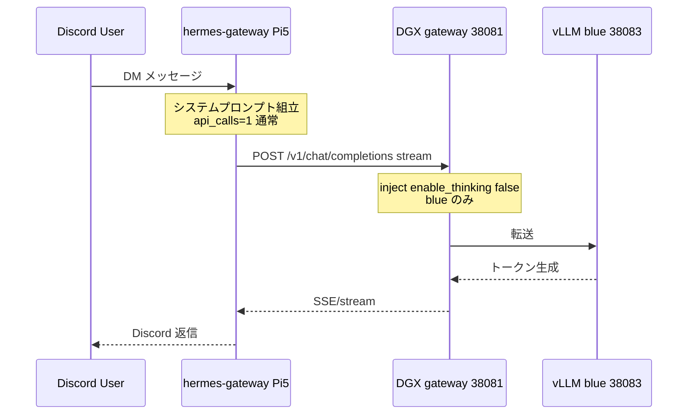

# KB-private-pi5-hermes-discord-e2e-and-latency: Discord 雑談 E2E・遅延・8K・keep-warm・enable_thinking

- **Status**: operational（2026-05-24 実機確認・レイテンシ改善済）
- **Related**: [private-pi5-hermes-deploy.md](../runbooks/private-pi5-hermes-deploy.md) · [KB-private-pi5-hermes-dgx-403-bearer-token.md](./KB-private-pi5-hermes-dgx-403-bearer-token.md) · [private-pi5-hermes-agent-plan.md](../plans/private-pi5-hermes-agent-plan.md) · [dgx-system-prod-local-llm.md](../runbooks/dgx-system-prod-local-llm.md)

## Context

私用 Pi5 上の **Hermes Agent v0.14.0**（`hermes-gateway`）から **Discord DM**（許可 User ID のみ）で DGX `system-prod-primary`（`http://100.118.82.72:38081/v1`、blue / vLLM / Qwen3.6-27B-NVFP4）へ雑談。

StackChan `stackchan-bridge`（`:18080`・`X-LLM-Token`）と **同一 Pi5・同一 DGX** だが **プロセス・ユーザー・設定・認証ヘッダは分離**。

## アーキテクチャ（応答までの経路）



| 層 | コンポーネント | 役割 |
|----|----------------|------|
| 入口 | Discord Bot · `hermes-gateway.service` | 許可 User のみ・`require_mention: false` |
| エージェント | Hermes `conversation_loop` | 1 通 ≒ **API call 1 回**（ツール無効時） |
| 認証 | `Authorization: Bearer`（`OPENAI_API_KEY`） | [KB 403](./KB-private-pi5-hermes-dgx-403-bearer-token.md) |
| 到達 | Tailscale Pi5 → DGX `100.118.82.72:38081` | |
| Gateway | `scripts/dgx-local-llm-system/gateway-server.py` | Bearer/X-LLM-Token・**blue chat で thinking 注入** |
| 推論 | `system-prod-primary` @ `127.0.0.1:38083` | 実効コンテキスト **~8192** |
| 温存 | `hermes-dgx-keep-warm.timer`（Pi5） | コールドスタート回避（制御トークン要） |

## 確定仕様（雑談プロファイル）

正本テンプレ: [`private-pi5-hermes.config.yaml.j2`](../../infrastructure/ansible/templates/private-pi5-hermes.config.yaml.j2)

| 領域 | 設定 | 意図 |
|------|------|------|
| LLM | `provider: custom:dgx-system-prod` + `key_env: OPENAI_API_KEY` | bare `custom` は `no-key-required`（Hermes #28660） |
| 起動検証 | `model.context_length: 65536` | Hermes 最低 64K。**DGX API 実効 ~8192** |
| 出力上限 | `model.max_tokens: 256` | 未設定時 Hermes 既定が大きく生成が長引く |
| 推論（Hermes） | **`agent.reasoning_effort: none`** | gateway が読む正本（`model.` 直下だけでは不十分） |
| 推論（DGX） | **`custom_providers.extra_body`** + **gateway 注入** | vLLM は `reasoning_effort` だけでは思考が止まらない |
| 圧縮 | `compression.enabled: false` | 8K 上流と Hermes 64K 圧縮要件の不整合 |
| ツール | `disabled_toolsets` 全主要 + `platform_toolsets.discord: []` | 既定ツール JSON ~53KB が 8K 超の主因 |
| メモリ | `memory.memory_enabled: false` | プロンプト肥大抑制 |
| Discord | `require_mention: false` | DM + `DISCORD_ALLOWED_USERS` |
| 補助 | `auxiliary.title_generation: main` timeout 20 | `auto` は OpenRouter 試行で遅延（応答後・非ブロック） |
| keep-warm | `hermes-dgx-keep-warm.timer` | `private_pi5_dgx_runtime_control_token` 必須 |

秘密: [`private-pi5-hermes.env.j2`](../../infrastructure/ansible/templates/private-pi5-hermes.env.j2) — fragment のみ。

## レイテンシ調査（2026-05-24 実測）

### 症状の変遷

| 段階 | ユーザー体感 | `agent.log` の `latency=` | `out` tokens | 主因 |
|------|-------------|---------------------------|--------------|------|
| 初回 E2E | ~1 分/通 | 60〜262 s | 303〜1472 | 思考トークン + 8K/ツール問題混在 |
| keep-warm 後も遅い | ~1〜2 分 | **97〜107 s** | **492〜541** | **思考モード ON**（warm でも遅い） |
| config `extra_body` のみ | まだ ~1 分 | **57〜90 s** | **288〜456** | Hermes が **毎ターン `request_overrides` を `{}` で上書き**し DGX に未到達 |
| gateway **inject** 後 | **だいぶ速い**（ユーザー確認） | （要再計測） | — | `enable_thinking: false` が vLLM に届く |

### DGX 単体ベンチ（Pi5 から・同一モデル）

| 条件 | 時間 | completion_tokens | 備考 |
|------|------|-------------------|------|
| `reasoning_effort: none` のみ | **~25 s** | 128 | `content` 空・`reasoning` 長文 |
| `chat_template_kwargs.enable_thinking: false` | **~2 s** | ~11 | 本文あり |
| Hermes 相当プロンプト + thinking off | **~4 s** | ~20 | in ~658 |
| gateway 経由・kwargs なし（inject 後） | **~4 s** | ~20 | `inject_blue_chat_completions_defaults` |

**結論**: ボトルネックの **9 割は DGX 推論（思考トークン生成）**。keep-warm は **コールドスタート**用で、思考 ON のままでは **数十〜100 秒/通**は変わらない。

### agent.log の読み方（Pi5）

```bash
grep -E 'latency=|response ready|API call' /home/hermes/.hermes/logs/agent.log | tail -20
```

- **`latency=`** … 単一 `chat/completions` の DGX 側時間（秒）
- **`response ready: time=`** … Discord 受信から送信まで（Hermes オーバーヘッド含む）
- **`api_calls=1`** … ツール無効なら 1 通 1 回が正常

## Root cause: なぜ `reasoning_effort: none` だけでは足りないか

1. **vLLM / Qwen3.6（blue）** は OpenAI 互換の `reasoning_effort` より **`chat_template_kwargs.enable_thinking`** が効く（[dgx-system-prod-local-llm.md](../runbooks/dgx-system-prod-local-llm.md)・StackChan bridge 同様）。
2. Hermes **CustomProfile**（`provider=custom`）は Ollama 向けに `think: false` のみ。vLLM には無効。
3. `custom_providers.extra_body` は `init_agent` で `request_overrides` にマージされるが、**毎ターン** gateway が次で上書きする:

```text
agent.request_overrides = turn_route.get("request_overrides") or {}
# turn_route は fast_mode 以外ほぼ {}
```

→ **Pi5 config だけでは DGX に `enable_thinking: false` が届かない**ことがある。

### Fix（実装済・2026-05-24）

| 層 | 対策 | ファイル |
|----|------|----------|
| **DGX（正）** | blue の `POST .../chat/completions` で `enable_thinking: false` を注入（未指定時） | [`gateway-server.py`](../../scripts/dgx-local-llm-system/gateway-server.py) `inject_blue_chat_completions_defaults` |
| Pi5 Hermes | `agent.reasoning_effort: none`・`model.max_tokens: 256`・`extra_body`（将来 Hermes 修正時用） | `private-pi5-hermes.config.yaml.j2` |
| Pi5 運用 | `hermes-dgx-keep-warm.timer` | [`dgx_keep_warm.py`](../../scripts/private-pi5-hermes/dgx_keep_warm.py) |

**DGX 反映手順**（Runbook 準拠）:

```bash
scp scripts/dgx-local-llm-system/gateway-server.py \
  ubudgxkoushi@100.118.82.72:/srv/dgx/system-prod/bin/gateway-server.py
# PID 終了 → rm gateway-server.pid → start-gateway-server.sh
```

## keep-warm（コールドスタート対策）

| 項目 | 内容 |
|------|------|
| 単位 | `hermes-dgx-keep-warm.service`（oneshot）+ `.timer` |
| 間隔 | 起動 **3 分**後、以降 **10 分**毎 |
| 処理 | `probe_runtime_ready` → 未 warm なら `POST /start` + `/v1/models` 待ち |
| 前提 | fragment: `private_pi5_dgx_runtime_control_token`（DGX `LLM_RUNTIME_CONTROL_TOKEN`） |
| 共有コード | [`dgx_runtime_client.py`](../../scripts/private-pi5-stackchan-bridge/dgx_runtime_client.py)（`warm_runtime_if_needed`） |

**注意**: warm でも **思考 ON** なら ~1 分/通のまま。keep-warm と thinking 注入は **別問題**。

## 実機タイムライン（2026-05-24 JST）

| 時刻 | 事象 |
|------|------|
| 17:44 | LLM **403** → [KB 403](./KB-private-pi5-hermes-dgx-403-bearer-token.md) |
| 18:06 | 8193 tokens・圧縮ループ → ツール無効テンプレ |
| 18:33 | E2E 成功・体感 ~1 min/通 |
| 18:57〜19:01 | `latency` 97〜107 s（思考 ON・keep-warm 済） |
| 19:11〜19:14 | config `extra_body` 後も 57〜90 s（Hermes overrides 上書き） |
| 19:20 頃 | DGX gateway inject 反映・Hermes 再デプロイ |
| 19:20+ | ユーザー体感 **だいぶ速い**（DGX 単体 ~4 s 級と整合） |

## 症状別トラブルシュート

### HTTP 403

→ [KB-private-pi5-hermes-dgx-403-bearer-token.md](./KB-private-pi5-hermes-dgx-403-bearer-token.md)

### 無応答（ホーム案内のみ）

`require_mention: true` → テンプレは `false`。`/reset`。

### Context too large / 圧縮ループ

ツール無効テンプレ未反映 → 再デプロイ + `/reset`。

### 遅い（Typing が長い）

| 確認 | コマンド / 観点 |
|------|----------------|
| DGX warm | `curl -H "Authorization: Bearer $KEY" http://100.118.82.72:38081/v1/models` → 200 |
| keep-warm | `systemctl is-active hermes-dgx-keep-warm.timer` |
| 思考注入 | gateway `gateway-server.py` が **inject 版**か（DGX 再起動済みか） |
| agent.log | `latency=` が **&lt;15s** か（数十秒なら thinking 疑い） |
| 直接ベンチ | Pi5 から `chat_template_kwargs.enable_thinking:false` で ~2〜4 s になるか |

### title_generation 警告

```
Title generation failed: Provider 'main' ... no API key
```

応答**後**のバックグラウンド。体感遅延の主因ではない。無視可。

## 検証コマンド（Pi5）

```bash
systemctl is-active hermes-gateway hermes-dgx-keep-warm.timer stackchan-bridge

# Bearer
sudo -u hermes bash -lc 'set -a; source ~/.hermes/.env; set +a; \
  curl -sf -o /dev/null -w "models=%{http_code}\n" \
  -H "Authorization: Bearer $OPENAI_API_KEY" \
  http://100.118.82.72:38081/v1/models'

# gateway inject（enable_thinking を付けない）
sudo -u hermes python3 -c "
import json, os, time, urllib.request
from pathlib import Path
key=[l.split('=',1)[1].strip() for l in Path('/home/hermes/.hermes/.env').read_text().splitlines() if l.startswith('OPENAI_API_KEY=')][0]
p={'model':'system-prod-primary','messages':[{'role':'user','content':'こんにちは'}],'max_tokens':64}
t=time.time()
urllib.request.urlopen(urllib.request.Request('http://100.118.82.72:38081/v1/chat/completions',json.dumps(p).encode(),headers={'Authorization':f'Bearer {key}','Content-Type':'application/json'},method='POST'),timeout=60)
print('sec', round(time.time()-t,1))
"

grep -E 'latency=|response ready' /home/hermes/.hermes/logs/agent.log | tail -10
journalctl -u hermes-dgx-keep-warm.service -n 3 --no-pager
```

## Prevention

- blue vLLM へ OpenAI 互換クライアントを繋ぐときは **`enable_thinking: false`** を契約に含める（gateway 注入またはクライアント `extra_body`）。
- Hermes は **`agent.reasoning_effort`** と **`model.max_tokens`** をテンプレで明示。
- Discord 導入時は `/reset` 後 **3 通**の `latency=` を KB に記録。
- DGX gateway 更新は **PID ファイル削除**を忘れない（古コードのまま `exit 0` し得る）。

## 次の改善候補（さらに速く）

| 優先 | 項目 | 根拠 |
|------|------|------|
| 高 | Hermes **システムプロンプト短縮** | 実測 in **~575 tokens**（「こんにちは」だけでも） |
| 高 | StackChan 同様 **`max_tokens` 160〜192** | bridge は [stackchan_chat_core.py](../../scripts/private-pi5-stackchan-bridge/stackchan_chat_core.py) で cap |
| 中 | `title_generation` 無効化 | ログ警告・任意 OpenRouter |
| 中 | より軽量モデル / green backend 検討 | 品質トレードオフ |
| 低 | Hermes upstream の `request_overrides` 上書き修正 | upstream 取り込み時 |

## References

- 計画: [private-pi5-hermes-agent-plan.md](../plans/private-pi5-hermes-agent-plan.md)
- Runbook: [private-pi5-hermes-deploy.md](../runbooks/private-pi5-hermes-deploy.md)
- DGX: [dgx-system-prod-local-llm.md](../runbooks/dgx-system-prod-local-llm.md)
- Playbook: [private-pi5-hermes.yml](../../infrastructure/ansible/playbooks/private-pi5-hermes.yml)
- Tests: [test_gateway_server.py](../../scripts/dgx-local-llm-system/tests/test_gateway_server.py)
